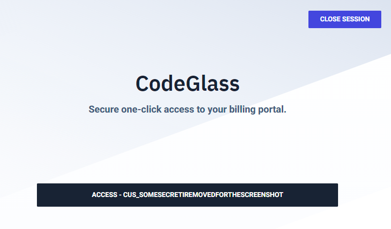
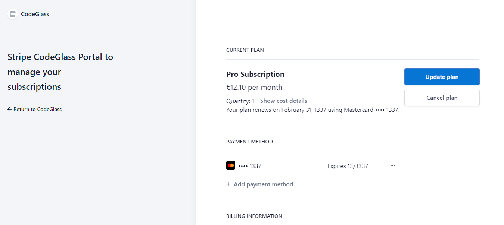
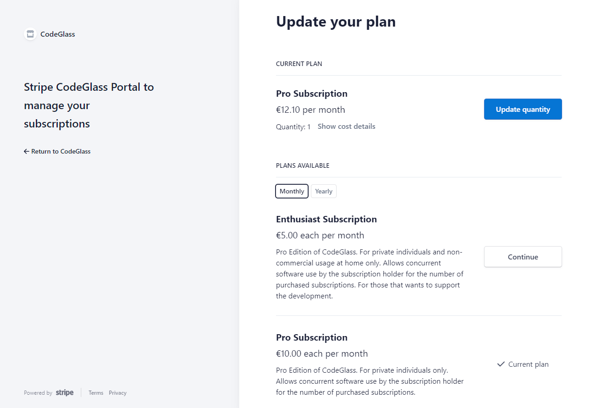
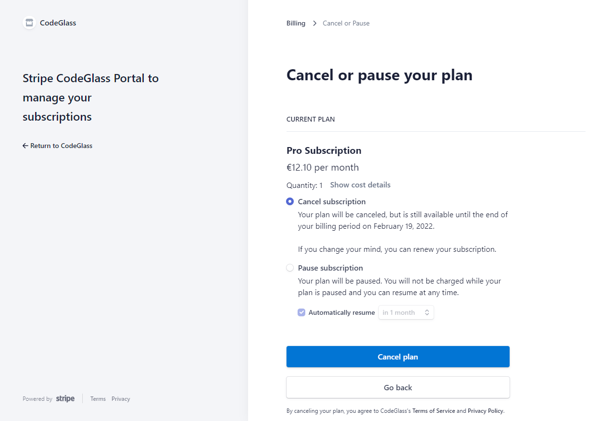
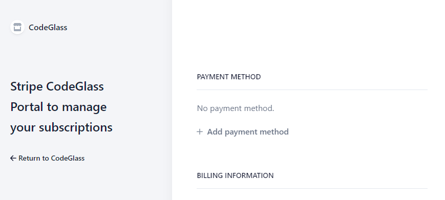
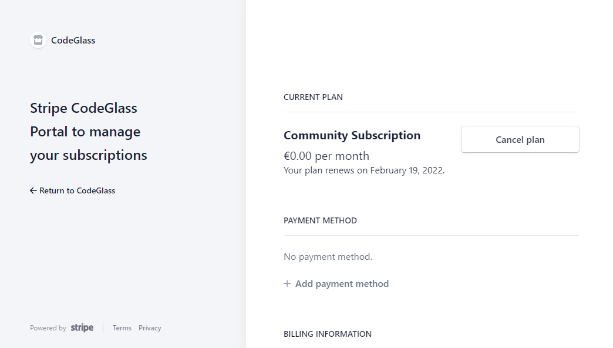

# Change or Cancel Subscription

tldr; click on this button:  
<button><a href="https://mysuperportal.com/access/codeglass/" target="_blanc"> Click here to upgrade your subscription </a></button>  
or if you did not have a subscription or it is expired: 
<button><a href="https://codeglass.io/offers" target="_blanc"> Buy Subscription </a></button>

# Learn more

You can change your subscription any time to better fit your needs.

You can do this by going to using your [Stripe CodeGlass Account](Account.md#stripe-codeglass-account).
For most of you it is the same email you use to [login](../views/Splashscreen.md#login) into CodeGlass.

With this email you can get a magic login link mailed to you at [https://mysuperportal.com/access/codeglass/](https://mysuperportal.com/access/codeglass/).

The link in your email should bring you to a page similar to this:

And click on the "Access - CUS_..." button, if you do not see that button click [here](#no-access-button)

You should get a page similar to this:

And you should see two buttons, ["Update plan"](#update-plan) or ["Cancel plan"](#cancel-plan) button

if you do not see a ["Update plan"](#update-plan) button, click [here](#no-update-plan-button)

If you do not see any button at all, click [here](#no-subscription)

## Update Plan

On this screen you can buy additional subscritpions of the same type by clicking the "Update quantity" button or upgrade to another subscription by selecting one below.  



By buying multiple subscriptions, you can use the software concurrently for the number of purchased subscriptions and unlock additional user accounts for ([offline](../LicenseTypes/OfflineOrganisationSubscription.md)) [organization](../LicenseTypes/OrganisationSubscription.md) and [experimental](../LicenseTypes/ExperimentalSubscription.md) subscriptions.

Changes to your subscription are immediately applied, and the cost difference is prorated.



## Cancel Plan

You can cancel or pause your subscription on this screen, and you can still use your subscription until the end of your term.



# FAQ

## No Access Button
If you do not see an access button you have most likely not entered a email that is tied to a subscription.
It can also happen if:

- The email you entered is not the ["License Manager"](Account.md#licensespring-codeglass-Account) Email.
    You have to contact the person that you got the license from.
- You received your subscription for free and do not have a [Stripe CodeGlass Account](Account.md#stripe-codeGlass-account).
    You can just buy a subscription from the [store](https://codeglass.io/offers)

If you think this is incorrect or need any support, don't hessitate to contact [contact](../../contact) us.

## No Subscription

If your screen looks like this you most likely do not have a vaild subscription (anymore).
You can just buy a new subscription from the [store](https://codeglass.io/offers)

If you think this is incorrect or need any support, don't hessitate to contact [contact](../../contact) us.

## No Update Plan Button

If your screen looks like this then there is an issue with your Stipe Account and have to [contact](../../contact) us to make changes to your subscription.  
We are very sorry if this happens to you, we are in contact with Stipe to solve this issue.
