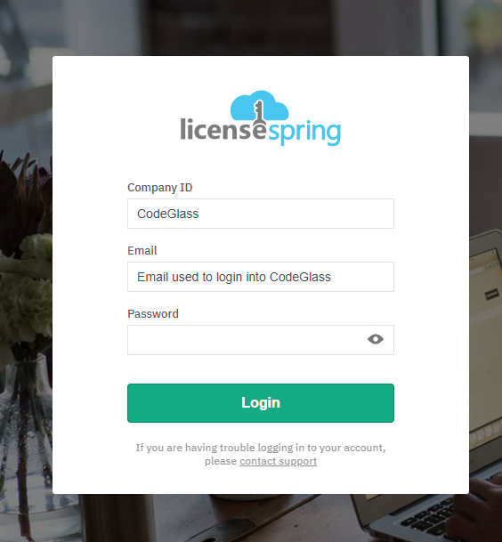
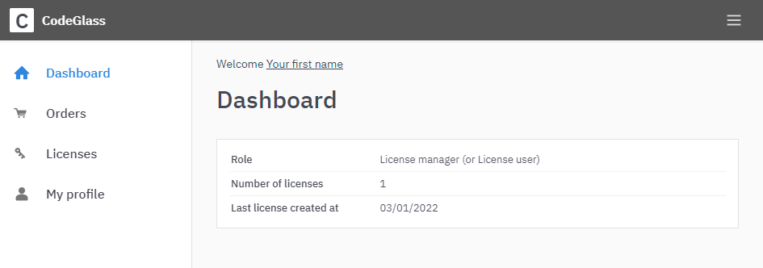
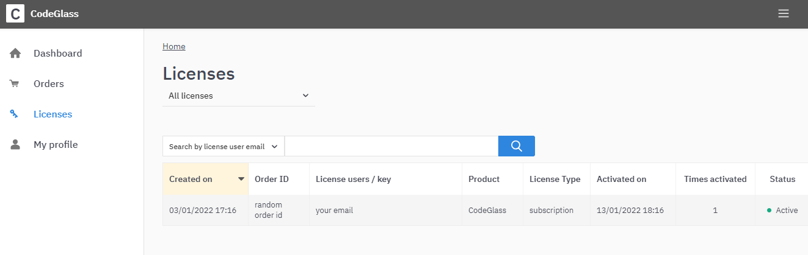
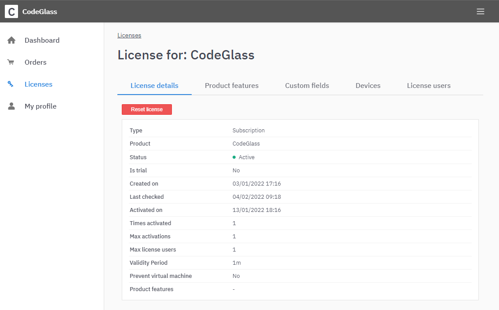
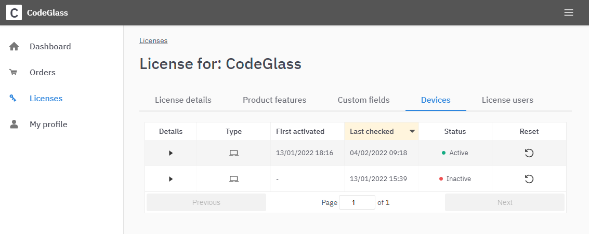
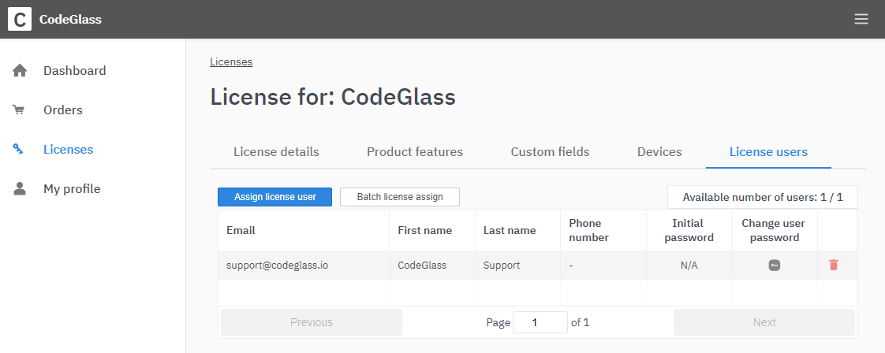

# CodeGlass License Portal

We use LicenseSpring as our License Provider and their end-user portal, in which you can manage your subscription/license.

This page is to explain a few things on their portal.

# Deactivate devices
You can come across that CodeGlass displays that your subscription is [activated on too many devices](../views/SplashScreen.md).

To deactivate a device, go to your [License](#license) and select the [Devices Tab](#devices)
On the devices tab, you can reset the activation of a device.

If you deactivated enough devices, and you still can't [login](../views/SplashScreen.md#login), you reached the limit on the amount of time you can deactivate a device.  
You need to [contact us](../../pages/contact) to reset your limit.

We do this to prevent License Sharing, as we are not on NetFlix Level yet.

Also, a friendly reminder, since you reached the limit, you use CodeGlass on many devices to maybe get another Subscription to use CodeGlass on multiple devices simultaneously and do not have to deactivate devices all the time.

# License Manager
You will get the License manager role if you are the owner of a ([Offline](../LicenseTypes/OfflineOrganisationSubscription.md))[Organization](../LicenseTypes/OrganisationSubscription.md) or [Experimental](../LicenseTypes/ExperimentalSubscription.md) subscription. 

They can can also create users account for others to [login](../views/Splashscreen.md#login) with into CodeGlass on the [users tab](#users)

# Portal Pages

## Login
To access the portal, head to [https://users.licensespring.com/login](https://users.licensespring.com/login).
You will see the following Login Screen:

You log in with Company ID "CodeGlass".  
The email and password are the same as your CodeGlass [Login](../views/Splashscreen.md#login) Credentials. 

If you did not log in to CodeGlass before, you could find these credentials in an email from LicenseSpring when you bought your subscription.

After login, you see the following dashboard:

Here you can see if you are a [license manager](#license-manager) or license user.

## Licenses

You should see your subscription when you go over to the [Licenses](https://users.licensespring.com/licenses) Page.  

You should never see more than one entry, even if you have bought multiple subscriptions. If you do please [contact us](../../pages/contact.md)

## License

After you click on your subscription in [Licenses](#licenses) you will get this screen.

Here can a [License Manager](#license-manager) reset any device or user assignment with the "Reset license" button.

## Devices

You can see all the devices you used in your CodeGlass Subscription on this page.  
You can also deactivate a device by clicking the Reset icon in case you reached the [activation limit](#deactivate-devices)

## Users

This page is only visible for [License Managers](#license-manager). They can create and assign users to a subscription. The number of users depends on the number of subscriptions you have bought.

You assign a user to a license by clicking the "assign license user" button.

Suppose you get a "Max license users number reached" notification. In that case, it means that you must [upgrade](ChangeSubscription.md) your subscription and buy [additional subscriptions](ChangeSubscription.md#update-plan) before you can assign more users.