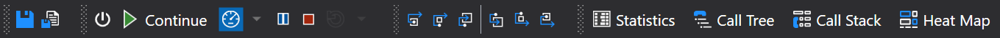

# Execution Control
When profiling an application, CodeGlass provides several actions to control its execution. These actions operate at the application level. In the future, we plan to extend this functionality to the function level ([roadmap](../Roadmap/PerFunctionAction.md)).

The screenshot below shows the toolbar containing the buttons for the available actions described below:

## Soft Off
Temporarily suspends most data collection while allowing the application to continue running at near full performance.

This mode is useful in production environments where long-term profiling overhead may impact performance. Soft Off can be enabled to minimize impact and later disabled when detailed profiling is required.

## Pause 
Temporarily halts application execution on the ([remote](CodeGlassHub.md#remote-hub)) [client](CodeGlassClient.md).

This can be triggered manually or automatically in response to specific events, such as [exceptions](Exceptions.md).

## Continue
Resumes execution of the application on the ([remote](CodeGlassHub.md#remote-hub)) [client](CodeGlassClient.md).

## Throttle
Limits the number of functions that can execute per second.

## Stop
Terminates application execution on the ([remote](CodeGlassHub.md#remote-hub)) [client](CodeGlassClient.md).

## Restart
Restarts the application on the ([remote](CodeGlassHub.md#remote-hub)) [client](CodeGlassClient.md).

# See Also:
- [Feature - Stepping](ApplicationInstanceStepping.md)
- [Feature - Exception Collection](Exceptions.md)
- [Roadmap - Per function Execution Control](../Roadmap/PerFunctionAction.md)