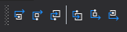

# (Thread / Exception) Stepping Forwards & Backwards
This feature provides precise control over the execution of your application. You can step forward through execution or step backward to review previously collected history, effectively emulating the application's state at each point in time.

Stepping will automatically stop if the specified step instruction is not reached within the configured timeout.

## Step Instructions

### Step Into
Steps to the next execution step, including function calls, returns, or tail calls.

### Step Over
Continues stepping until execution returns to the current function or exits it.
- **Technical definition**: Stepping continues until the number of function calls is less than or equal to the number of returns and tail calls.
- **Note**: The simplified explanation is valid for thread-specific stepping. For multi-threaded stepping, the technical definition applies.

### Step Out
Continues stepping until the current function returns.
- **Technical definition**: Stepping continues until the number of function calls is less than the number of returns and tail calls.
- **Note**: The simplified explanation is valid for thread-specific stepping. For multi-threaded stepping, the technical definition applies.

### Step Back Into
Steps back to the previous recorded execution step, including function calls, returns, or tail calls.

### Step Back Over
Steps back through previously recorded execution until returning to or exiting the current function.
- **Technical definition**: Steps back until the number of calls is less than or equal to the number of returns and tail calls.
- **Note**: The simplified explanation is valid for thread-specific stepping. For multi-threaded stepping, the technical definition applies.

### Step Back Out
Steps back to execution prior to the current function's call.
- **Technical definition**: Steps back until the number of calls is less than the number of returns and tail calls.
- **Note**: The simplified explanation is valid for thread-specific stepping. For multi-threaded stepping, the technical definition applies.

## Views Using This Feature
- [Realtime Call Tree Rendering](../views/ApplicationInstanceDockWindow/CallTreeRendering.md)
- [Realtime Call Stack Rendering](../views/ApplicationInstanceDockWindow/CallStackRendering.md)
- [Thread Detail View](../views/ApplicationInstanceDockWindow/ThreadDetailsView.md#thread-stepping-controls)
- [Process Menu](../views/ApplicationInstanceDockWindow/MenuBar.md#process-menu)

# See Also:
- [Application Instance Execution Control](ApplicationInstanceExecutionControl.md)
