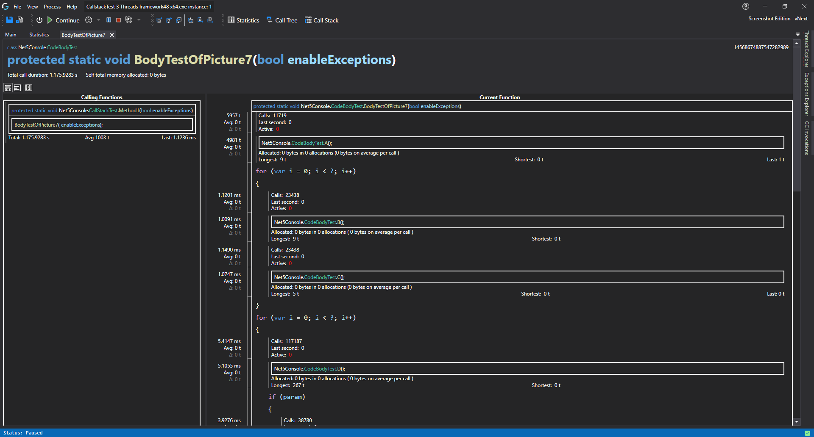

# Code Body Reconstruction


Unlike traditional profilers that only provide function-level timing, CodeGlass leverages runtime data to **reconstruct the internal structure of a function**, without requiring decompilation or access to the source code.

This enables granular insights into a function’s runtime behavior, including:

- Time spent within individual blocks of code
- Loop iteration frequencies
- Hot vs. cold control paths
- Real-time thread position within the function
- Execution time broken down by caller (e.g., Function A vs. Function B)
- Exact call sites within the reconstructed code body
- Execution paths required to reach specific calls
- Timing between internal calls
- Optimization opportunities (e.g., loop unrolling)
- Deviations between expected and actual control flow

Because reconstruction is based purely on observed execution data, it only reflects paths that were actually taken at runtime. This minimizes noise and highlights relevant, real-world control flow. Thus exposing behavioral anomalies without requiring any code instrumentation.

Typical insights include:
- Hidden or unexpected loop iterations
- High-frequency branching patterns
- Temporal inconsistencies in execution
- Profiling data from non-instrumentable environments

## Experimental Warning
This feature is currently experimental but is included in all [editions](../Editions.md), including the free tier. It is not restricted to the [Experimental Edition](../Editions/Experimental.md), as it is already proving useful despite its early-stage nature.

You are encouraged to report any issues. When reconstruction fails, a descriptive error will be shown and manual reporting is not necessary.

While experimental, the feature is stable and will not cause CodeGlass to crash.

## Limitations
Reconstruction relies on execution data and is therefore incomplete by design. Exhaustively capturing all possible control paths would require unbounded memory. The current implementation operates within practical memory limits.

We are actively working to improve both the accuracy and the completeness of this feature.

## Known Issues
- In some cases, reconstruction may not succeed even when runtime data appears sufficient.

## Views Using This Feature
- [Function Details View](../views/ApplicationInstanceDockWindow/CodeMemberDetailsView.md#code-body-view)
