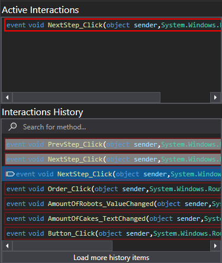

# Interaction Tracking

This feature enables you to observe and analyze key interactions that occur within your application. An interaction represents various runtime behaviors—such as event invocations or API calls. Support for additional types is planned for future releases.



## How It Works

This feature is integrated into both the [Call Tree Renderer](../views/ApplicationInstanceDockWindow/CallTreeRendering.md) and the [Call Stack Renderer](../views/ApplicationInstanceDockWindow/CallStackRendering.md).

The Interactions View consists of two lists:
- **Active Interactions**: Displays interactions that have been initiated but not yet returned.
- **Interaction History**: Displays previously observed interactions from the recorded call stack history.

The history view includes an arrow marker indicating the current position in the call stack. The number of items retained in the history is limited by the value defined in [render settings](../views/ApplicationInstanceDockWindow/CallTreeRendering.md#settings-window).

Both lists are updated in real-time based on stepping behavior. If you step into or out of a method associated with an interaction:
- The *Active Interactions* list will reflect the entry or exit.
- The *Interaction History* list will visually differentiate items based on temporal relevance. Items in the "future" relative to the current stack position are shown as grayed out.

### Interaction Navigation

- Clicking an item in the **Active Interactions** list centers that method in the rendering viewport. This does **not** modify the call stack state.
- Clicking an item in the **Interaction History** causes the call stack to rewind to the moment that interaction was triggered. If the interaction is no longer available in the retained call stack history, no action is taken.

> **Note:**  
> Your application must be paused to interact with the call stack. If not paused, attempting to click an interaction will display a notification prompting you to pause execution.

## Coloring

Each interaction item is bordered with a color corresponding to the thread on which the interaction occurred. For thread-color mapping details, refer to [Threads and Coloring](../views/ApplicationInstanceDockWindow/CallTreeRendering.md#threads-and-coloring).

## Max Interactions Reached

In rare cases, you may encounter the warning **"Max Interactions Reached"**. This occurs when the internal interaction ID counter exceeds the `uint32` maximum (4,294,967,295). If this happens, simply close and reopen the rendering view to reset the counter.

