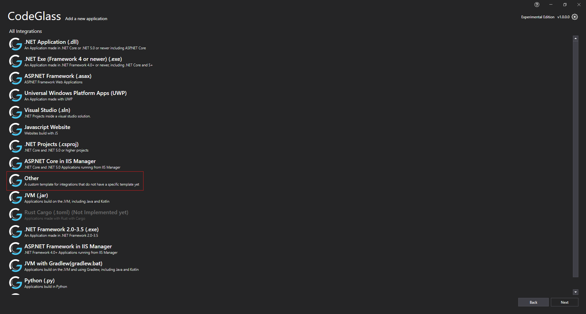
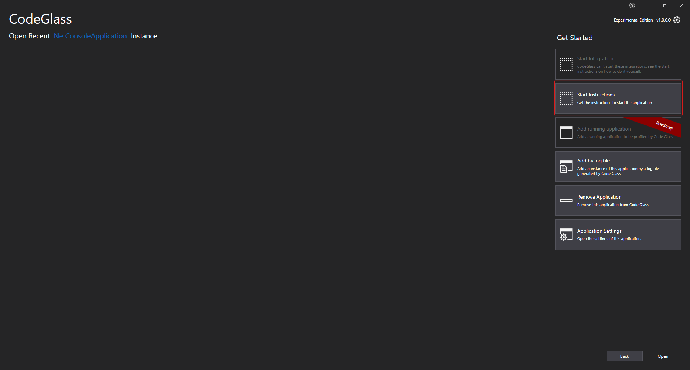
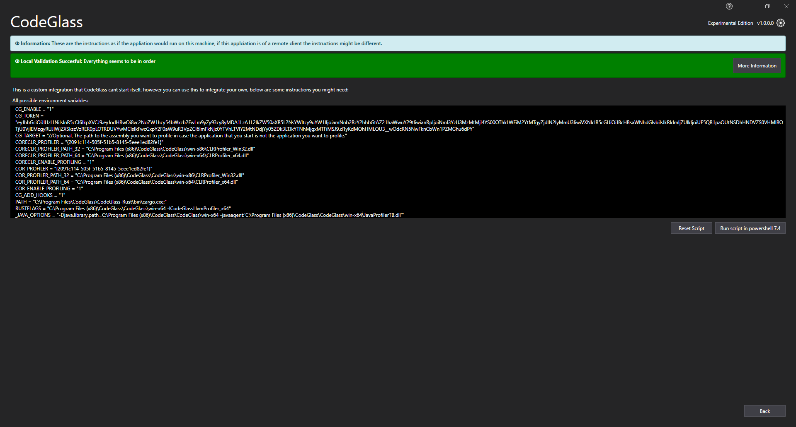
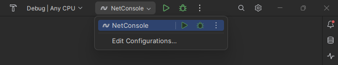
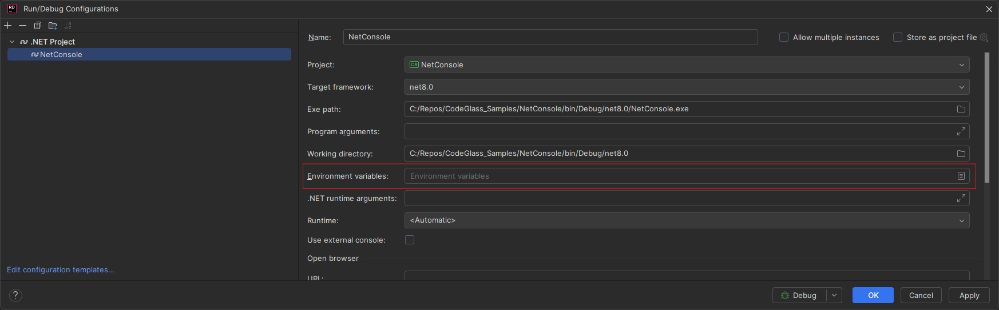
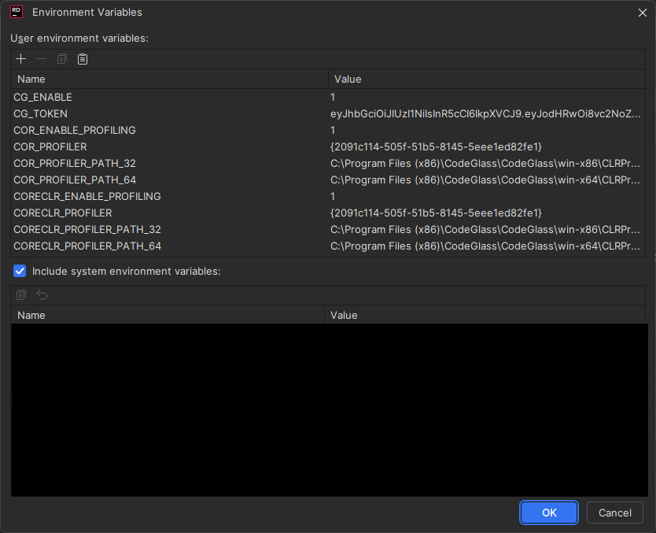
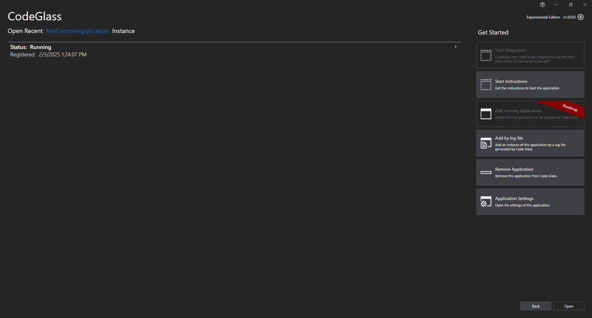

# JetBrains editor support
CodeGlass allows you to start profiling your applications right from your JetBrains editor. This page will explain how you can set this up for DotNet solutions. For the examples [Rider](https://www.jetbrains.com/rider/){:target="_blank"} will be used, but the following steps can also be used for different JetBrains editors and even different languages that CodeGlass supports, but some of the steps might be different. If you have any questions feel free to ask us a question by joining our [Discord server](https://discord.com/invite/ytczAxSmX4){:target="_blank"}.

## Adding your application
Start by adding a new application in CodeGlass with the "Other" template, if you have not yet added the application. Other DotNet related template can also work, but some of the steps might be slightly different. After selecting the "Other" template click the "Next" button and give your application a name and click "Create".

## Getting start instructions
In order to notify CodeGlass that you want to profile your application when you run it, your editor will need to set some environment variables. CodeGlass provides all these variables for you. These setting can be found by click the "Start Instructions" button.

Clicking the button will open the screen that can be seen below. Because we selected the "Other" template, CodeGlass does not exactly know what type of app you want to run. For this reason it will show all available options. Depending on your CodeGlass version and available integrations your list with options might vary from the screenshot below.

From the list of options the following options are important for this integration:
* CG_ENABLE
* CG_TOKEN
* CORECLR_PROFILER
* CORECLR_PROFILER_PATH_32
* CORECLR_PROFILER_PATH_64
* CORECLR_ENABLE_PROFILING
* COR_PROFILER
* COR_PROFILER_PATH_32
* COR_PROFILER_PATH_64
* COR_ENABLE_PROFILING

The options `CG_ENABLE` tells the profiler if it should attach or not. By setting it to '1' it will attach to your application. If you (temporarily) want to disable CodeGlass from attaching when running your application you can set this value to '0'. 
The option `CG_TOKEN` tells CodeGlass what application you are profiling. CodeGlass generates a unique token for every application that you add. If you want your instances to show up under a different application, you can change this token to the token of the other application. 
The other options are used to tell the DotNet runtime that you want to use a profiler and where the profiler is located. 

## Integrating with your editor
Now we can finally start adding these options to your JetBrains editor of choice. For this example Rider 2024.3.4 is used. To start, open Rider with the solution that you want to profile.
In the top right of your editor click on the button that has the option to edit the configuration of your startup project and click the button "Edit Configurations".

This will open the screen as can be seen below. All the values that we collected in the previous step can be placed in the field `Environment variables`. By pressing the little button on the right you open a little window that makes it easier to add the variables.

It is recommended to remove all the double quotes that CodeGlass placed around the variables as this might prevent Rider from correctly reading these values. After settings and applying these values you can run your application like your are used to.

If you now run your application and switch back to CodeGlass, you can see that a new instance has been added. Everytime you run your application a new instance will be added here.

## Trouble shooting
If your instance is not showing up after following the steps above and running your application, validate the following things.
* Is `CG_ENABLE` set to '1' in the environment settings in Rider?
* Try readding the value of `CG_TOKEN` in the environment settings by getting the token from CodeGlass. It is possible that CodeGlass invalidated your previous token.
* Validate that the path of `CORECLR_PROFILER_PATH_32`, `CORECLR_PROFILER_PATH_64`, `COR_PROFILER_PATH_32` and `COR_PROFILER_PATH_64` are pointing to a valid path.

If you checked these things and keep on having problems, feel free to join our [Discord server](https://discord.com/invite/ytczAxSmX4){:target="_blank"} and ask a question.