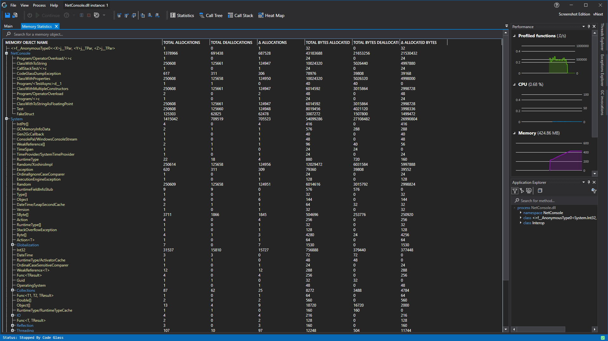

# Memory Profiling
With our [realtime profiling](../features/RealtimeDataCollection.md) we are able to solve many problems other profilers can't. With our memory profiler we can also help with memory related problems and help you find the parts of your application that consume a lot of memory.

## Available Statistics
At this point different pieces memory information can be viewed. 
First there are the dedicated memory statistics view like the onces here:
- [Memory Statistics View](../views/ApplicationInstanceDockWindow/MemoryStatisticsWindow.md)
- [Allocated By CodePath View](../views/ApplicationInstanceDockWindow/AllocatedByCodePathView.md)

Memory statistics have also been integrated into some of the other views. Those views can be found here:
- [Statistics View](../views/ApplicationInstanceDockWindow/StatisticsWindow.md#memory-statistics)
- [Function Details View](../views/ApplicationInstanceDockWindow/CodeMemberDetailsView.md#memory-statistics)