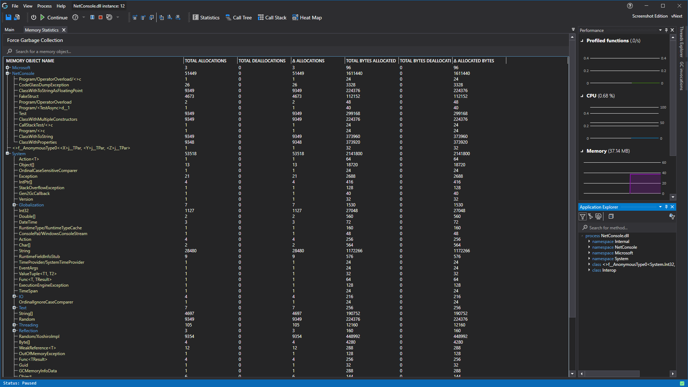

# Memory Profiling
With our [realtime profiling](../features/RealtimeDataCollection.md) we are able to solve many problems other profilers can't. With our memory profiler we can also help with memory related problems and help you find the parts of your application that consume a lot of memory. Not only can CodeGlass show you what objects are allocated a lot, but with out [allocated by codePath view](../views/ApplicationInstanceDockWindow/AllocatedByCodePathView.md), we can also show you which method allocated that object a lot.

## Available Statistics
Memory statistics can be found in two places within CodeGlass.

First there are the dedicated memory statistics view like the onces here:
- [Memory statistics view](../views/ApplicationInstanceDockWindow/MemoryStatisticsWindow.md)
- [Allocated by codePath view](../views/ApplicationInstanceDockWindow/AllocatedByCodePathView.md)

Besides the dedicated memory views whe have also integrated the memory statistics into some of the other statistics views. Those views can be found here:
- [Statistics view](../views/ApplicationInstanceDockWindow/StatisticsWindow.md)
- [Function details view](../views/ApplicationInstanceDockWindow/CodeMemberDetailsView.md)