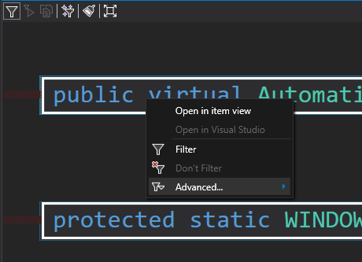

# Open in Visual Studio

This feature allows you to open most profiled methods directly in Visual Studio from within CodeGlass. Simply right-click on a method call and select **"Open in Visual Studio"** from the context menu, as shown below. CodeGlass maps the method using its associated PDB file to locate the corresponding source in your Visual Studio project.

This functionality is still in its early stages and has several [limitations](#limitations).

If the **Open in Visual Studio** option is grayed out, hovering over it will display a tooltip explaining why the action is unavailable.

## Limitations

- Only the [.NET runtime](./supportedruntimes.md#net-framework) is supported.
- The PDB file for the associated `.dll` or `.exe` must be present on the local device. This means:
  - You cannot open methods from external libraries like `System.*`.
  - This feature does not support release builds.
- Projects configured with Windows-only PDBs may not support async method navigation (due to state machine inlining). This primarily affects .NET Framework applications.
- Compiler-generated methods such as default constructors cannot be opened, as no user-defined source exists. Attempting to open such methods will trigger an explanatory popup.
- If you open a snapshot file recorded on another device, the required PDBs may be missing, and the feature will not work. Support for manual PDB path resolution is planned.
- CodeGlass cannot launch a new Visual Studio instance if none are currently running. It will notify you if no open instances are detected.
- If multiple Visual Studio instances are open:
  - CodeGlass attempts to match the correct instance based on the method’s source path.
  - If no exact match is found, it defaults to the most recently started instance.
- For large solutions with multiple running Visual Studio instances, the matching process may take longer than 500ms. In such cases:
  - CodeGlass temporarily opens the file in the last instance it searched.
  - It continues searching in the background.
  - Once the correct instance is identified, it is cached to speed up future lookups.
