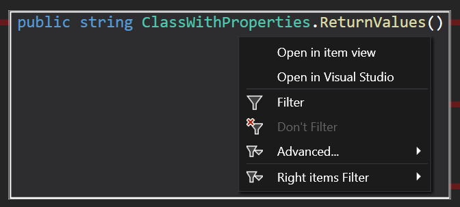

# Open in Visual Studio
This feature allows you to open most profiled method in Visual Studio, right from CodeGlass. You can do this by right clicking on any method call. When you do this, a context menu as shown below, opens. From here you can click on "Open in Visual Studio". We can do this by mapping the associated PDB file to the profiled method.

This feature is still very new and does still have some [limitations](#limitations). 

If the option for opening in Visual Studio is grayed out, you can hover over the button. The tool tip often explains why it is not possible to open that method in Visual Studio.

## Limitations
- Only the [.NET runtime](./supportedruntimes.md#net-framework) is supported.
- The PDB file of the .dll or .exe needs to be on the device you are trying to open the method on. This means that you, for example, cannot open calls to methods in the System namespace. But this also means that this feature does not work for release builds.
- If you have your PDB type set to platform specific/Windows only in your project we are not able to open your async methods as the state machine has hidden the implementation. This should only be a problem if you are running a .NET Framework application.
- We cannot open all compiler generated method calls. Things like the default constructor cannot be opened in Visual Studio because it does not exist in code. If you try to open it anyways CodeGlass will give you a popup telling you that it could not open this method.
- If you load a snapshot file that ran on a different device, the PDB file might not get found and this feature does not work anymore. We are planning on adding the option to specify the path to this PDB file yourself.
- If you have no Visual Studio instance open we cannot (yet) start a new instance of Visual Studio. CodeGlass does give you a popup to tell you that we could not find an open Visual Studio instance.
- If you have multiple Visual Studio instances open, we try to find the one that matches with the method you tried to open. If we could not find any Visual Studio instance that matches our searching criteria, we just open the file in the instance that was last started.
- If you have multiple Visual Studio instances open that contain very large solutions, it might take CodeGlass too long (> 500 ms) to find the correct matching Visual Studio instance. In this case we open the file in the last Visual Studio instance that we were searching in. After opening the file in a that Visual Studio instance, CodeGlass keeps searching in the background to find the correct matching Visual Studio instance. If we found the correct Visual Studio instance, we cache that instance so that we do not have to keep searching every time.