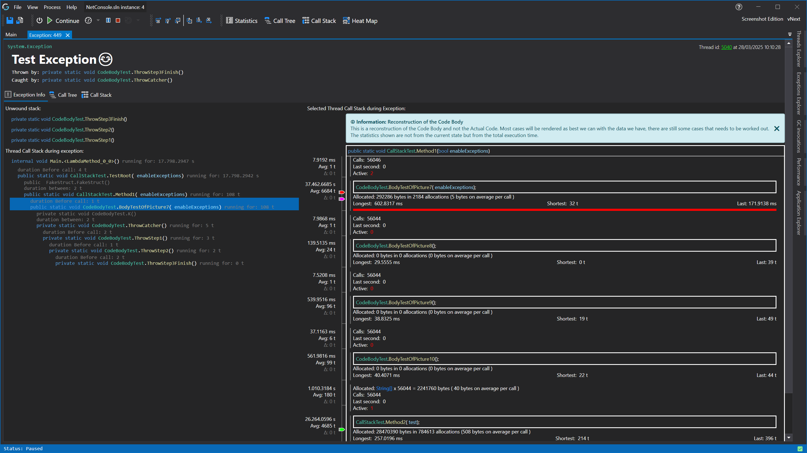

# Real-Time Profiling and Data Collection
What sets CodeGlass apart from many other profilers is its ability to capture and use profiling data in real time. Instead of waiting for a recorded log file, you get immediate access to live data as your application runs.

CodeGlass continuously collects real-time data, including a live [call stack](#callstack) and [statistics](#statistics). This information is instantly available through our [client](CodeGlassClient.md). While traditional profilers require you to stop and analyze logs afterward, CodeGlass gives you insights as it is happening.

With real-time data, you can interact with your application—press a button, call an API, or execute a command—and immediately see what happens inside. This helps you quickly identify unresponsive behavior, race conditions, or other performance issues using one of our [real-time renderers](RealtimeRendering.md).

Despite its continuous data collection, CodeGlass keeps overhead low to ensure the application remains usable. However, we recommend configuring [profiling data filters](ProfilingDataFiltering.md) to optimize performance.

Unlike sampling profilers, CodeGlass captures every function call without missing anything. Calls can be skipped only if they are specifically excluded using a [start filter](ProfilingDataFiltering.md#application-instance-start-filters).

You can also temporarily pause data collection using the profiler’s [Soft Off](ApplicationInstanceExecutionControl.md#soft-off) mode, allowing your application to run with nearly full performance.

The prominent data we collect in realtime currently are:
- The [callstack](#callstack)
- All kind of [statistics](#statistics)
- All [exceptions](#exceptions)
- All [memory allocations and deallocations (experimental)](#memory)
- All [garbage collection invocations (experimental)](#garbage-collection-invocations)

## Call Stack
CodeGlass collects the application's call stack in real time, capturing every change, bit it a function call, a return, or tail calls.

Unlike sampling profilers, CodeGlass does not miss any calls. However, calls can be skipped if they are excluded using a [start filter](ProfilingDataFiltering.md#application-instance-start-filters).

This data is primarily used for our [realtime rendering](RealtimeRendering.md) and [code body reconstruction](CodeBodyReconstruction.md) feature.

## Statistics
We collect all kinds of statistics in real-time; these include but are not limited to:

- CPU, the percentage of CPU usage.
- Memory, the amount of memory in use.
- Active Calls, the number of active calls in a class, namespace or function.
- Active Threads, the number of active threads in a class, namespace or function.  
- Total Calls, the total number of calls made to a function.
- Total Call Duration, the total amount of [measured time](#time-measurement) spent in a function.
- AVG, the average amount of [measured time](#time-measurement) spend in a function.
- Longest Call, the longest [measured time](#time-measurement) spend in a function.
- Shortest Call, the shortest [measured time](#time-measurement) spend in a function.
- Δ Calls, amount of calls that were made to a function in the last second.
- Δ Duration, the amount of [measured time](#time-measurement) spend in a function in the last second.

 

When you double-click an item in the tree view, it will open the [Object Details View](../views/ApplicationInstanceDockWindow/ObjectDetailsView.md) or [Function Details View](../views/ApplicationInstanceDockWindow/CodeMemberDetailsView.md) of the selected item.

### Time Measurement
To get more information on how we measure time, see [Feature - Time Measurement](TimeMessurement.md)

## Exceptions
CodeGlass captures all exceptions that occur in your application, even if they are not caught.
Along with the exception, we collect the unrolled stack trace up to the nearest catch block, as well as the [real-time collected callstack](#call-stack). However, the level of detail depends on how you have configured your [profiling data filters](ProfilingDataFiltering.md).

More information about our exception collection can be found at the [exceptions feature page](Exceptions)
 

## Memory
Memory profiling is a new feature in CodeGlass and is still under development. Currently, it is available only as an experimental feature in our [Experimental Edition](../Editions/Experimental.md) and supports a limited number of [supported runtimes](supportedruntimes.md).

We collect various memory related data, including:
- Total allocations, the number of times an object was allocated.
- Total bytes allocated, the total memory allocated by an object.
- Total deallocations, the number of times an object was deallocated.
- Total bytes deallocated, the total memory freed from deallocations.

Besides showing you the objects that consume a lot of memory, CodeGlass also tracks which functions allocated them, how often they were allocated, and the exact points within the function body these allocations occurred.

More information about our memory profiler can be found at the [memory profiling feature page](MemoryProfiling)
 

## Garbage Collection Invocations
Garbage collection invocations is a new feature in CodeGlass and is still under development. Currently, it is available only as an experimental feature in our [Experimental Edition](../Editions/Experimental.md) and at this point it is only supported by the [Julia](supportedruntimes.md#julia) and [.NET](supportedruntimes.md#net-framework) runtimes.

If your applications creates a lot of memory, garbage collection can take a lot of time and significantly slow your application down. To be able to track these kind of issues down CodeGlass will track every garbage collection that gets triggered by your application. 

We collect various garbage collection related data, including:
- The function that triggered the garbage collection.
- How long it took to execute garbage collection.
- How much memory was deallocated during this garbage collection.
- Every object that was deallocated and the function that that piece of memory was originally allocated in.

More information about garbage collection information can be found at the [garbage collection feature page](GarbageCollection).
 

# See Also:
- [Feature - Realtime Rendering](RealtimeRendering.md)
- [Feature - Execution Control](ApplicationInstanceExecutionControl.md)
- [Feature - CodeGlass Client](CodeGlassClient.md)
- [Feature - Profiling Data Filtering](ProfilingDataFiltering.md)