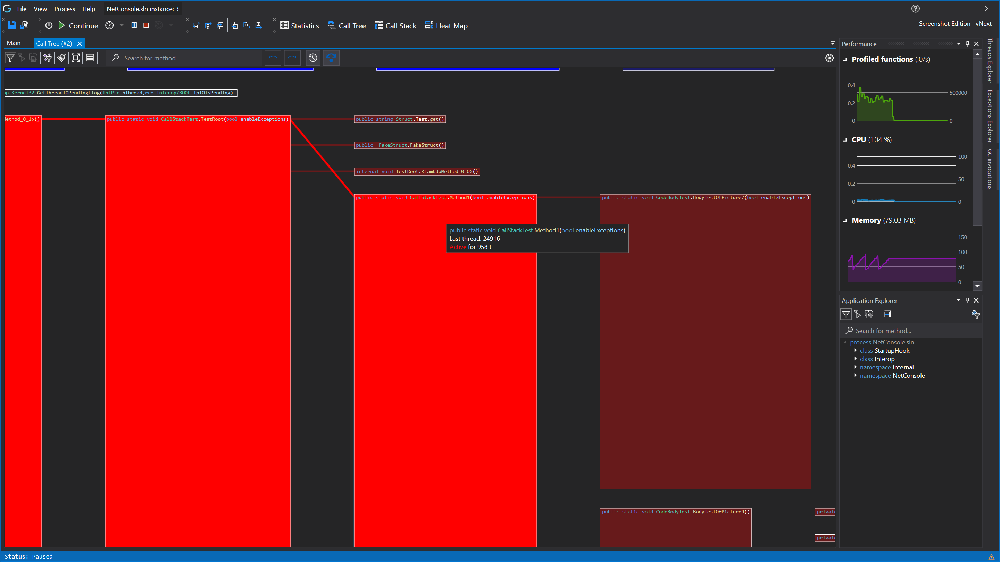
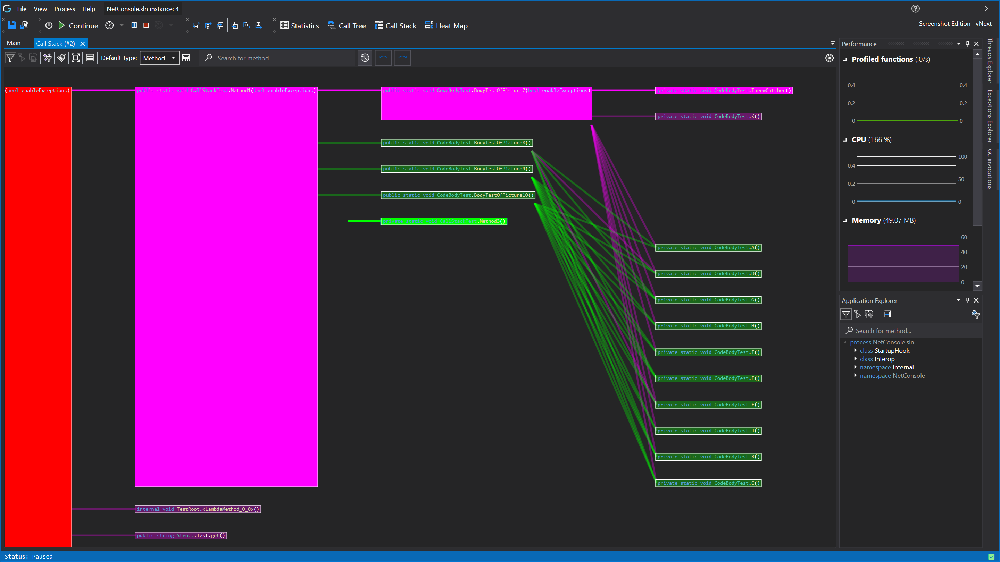

# Realtime Rendering

With code glass you can visualise in realtime the data from the profiled application, these [render types](#render-types) include:
- [Call Tree](#realtime-call-tree-rendering)
- [Call Stack](#realtime-call-stack-rendering)
- [Code Heat map](#realtime-code-heatmap)

Many more render types, like [thread specific rendering](../Roadmap/ThreadRendering.md) will be added in the future.



## Render Types
### Realtime Call Tree Rendering


See [View - Realtime Call Tree Rendering](../views/ApplicationInstanceDockWindow/CallTreeRendering.md) or [View - Exception Call Tree Rendering](../views/ApplicationInstanceDockWindow/ExceptionDetailsView.md#exception-call-tree-view) for view specific information.
 
This render type gives you a view into the call tree, it updates in real time while the applciation is running but will also desplay previous collected data. 

What is rendered is reflected with what [profiling data filters](ProfilingDataFiltering.md) you have set.

The rendering does also reflect [call stack steps](ApplicationInstanceStepping.md) that you might have made, forwards but also backwards! 

Every thread rendered is assigned the most diferent color available, this is why the first 3 threads are Reg, Green and Blue (RGB) Then it will start using the most different shades of RGB and so forward.

This render type does not combine calls to the same function (Like ([grouped](#realtime-grouped-call-stack-rendering)) [Call Stack rendering](#realtime-call-stack-rendering)) 
but instead seperates them per root function.

So for example
```
Thread 1 (red)   has a call stack of: A() -> B() -> C()
Thread 2 (green) has a call stack of: B() -> C()
Thread 3 (blue)  has a call Stack of: A() -> D() -> C()
```

would result in render:
```
A() r-> B() r-> C()
|   b-> D() b-> C()
B() g-> C()
```

For full thread seperated rendering see [Roadmap - Thread rendering](../Roadmap/ThreadRendering.md)


### Realtime Call Stack Rendering


See [View - Realtime Call Stack Rendering](../views/ApplicationInstanceDockWindow/CallStackRendering.md) or [View - Exception Call Stack Rendering](../views/ApplicationInstanceDockWindow/ExceptionDetailsView.md#exception-call-stack-view) for view specific information.

This render type gives you a view into the call stack, it updates in real time while the applciation is running but will also desplay previous collected data. 

The rendering does also reflect [call stack steps](ApplicationInstanceStepping.md) that you might have made, forwards but also backwards! 

What is rendered is reflected with what [profiling data filters](ProfilingDataFiltering.md) you have set.

Every thread rendered is assigned the most diferent color available, this is why the first 3 threads are Reg, Green and Blue (RGB) Then it will start using the most different shades of RGB and so forward.

It combines all calls to the same specified data item type (like class or namespace) instead of only to function.

So for example
```
Thread 1 (red)   has a call stack of: A() -> B() -> C()
Thread 2 (green) has a call stack of: A() -> D() -> C()
Thread 3 (blue)  has a call Stack of: A() -> F() -> E()
```

would result in:
```
A() r-> B() 
|           rg-> C()
|   g-> D()
|   b-> F() b -> E();
```




### Realtime Code Heatmap


See [View - Realtime Code Heat map](../views/ApplicationInstanceDockWindow/CodeHeatMap.md) for view specific information.

This render type gives you a Heat map kind of view into the realtime or previous collected data.

With this you can view multiple realtime heat maps based on the data object type and statistics.<br/>
For C# applications those are:
- Method
- Property
- Class
- Namespace
- Process


And the current selectable statistics are:
- None
- Total Calls
- Total Call Duration
- Average Call Duration
- Active Calls
- Active Threads
- Longest Call
- Shortest Call


## Example Use cases

### Find racing conditions
By using ([grouped](#realtime-grouped-call-stack-rendering)) [Call Stack rendering](#realtime-call-stack-rendering) it will show you when threads cross eachother, which can greatly help you find bugs relating to racing conditions in your code. 

What is rendered is reflected with what [profiling data filters](ProfilingDataFiltering.md) you have set.

The rendering does also reflect [call stack steps](ApplicationInstanceStepping.md) that you might have made, forwards but also backwards! 


### Find why your application is slowing down or unresponsesive
by using one of the [call tree](#realtime-call-tree-rendering) or ([grouped](#realtime-grouped-call-stack-rendering)) [Call Stack](#realtime-call-stack-rendering) renderers you can instantly see what code the application is running and find our where it is slowing down on what causes it to be unresponsive.


### Find bad behaving code
By using the [code heat map](#realtime-code-heatmap) you can easily find out which part of your program is behaving badly. 


## Limitations
Currently it does not show when code throws or causes an exception, this will be added in the future. 

## Views using this feature
- [View - Call Tree Rendering](../views/ApplicationInstanceDockWindow/CallTreeRendering.md)
- [View - Call Stack Rendering](../views/ApplicationInstanceDockWindow/CallStackRendering.md)
- [View - Grouped Call Stack Rendering](../views/ApplicationInstanceDockWindow/GroupedCallStackRendering.md)
- [View - Code heat map](../views/ApplicationInstanceDockWindow/CodeHeatMap.md)


# See Also:


