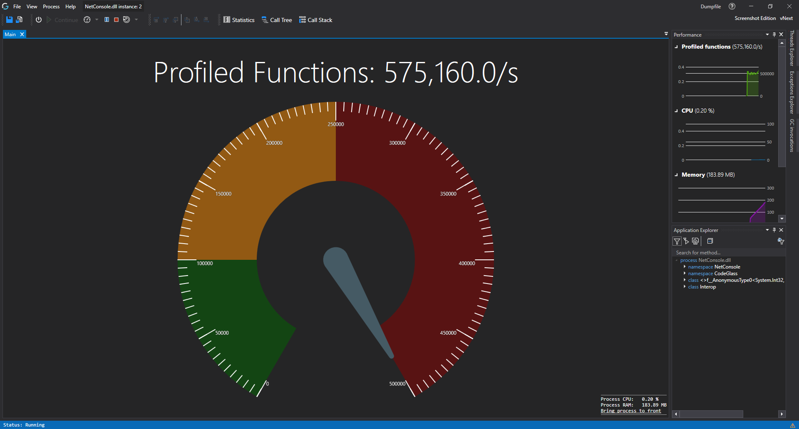

# Application Instance Window

This is the view that you get when you [start a new instance](mainwindow/applicationInstance.md). 
This view is quite extensive and has allot of functionality, we go in depth by the different [menu items](#menu-bar) and [toolbar items](#toolbar).

If you are wondering, the current open tabs and tool panes in the screenshot are:
- [Main Tab](ApplicationInstanceDockWindow/MainWindow.md)
- [Call Tree Render Tab](ApplicationInstanceDockWindow/CallTreeRendering.md) (Other Tab next to Main)
- [Code Member Details Tab](ApplicationInstanceDockWindow/CodeMemberDetailsView.md) (Other Tab next to Call Tree Render)
- [Performance Tool Pane](ApplicationInstanceDockWindow/PerformanceView.md)
- [Application Explorer Tool Pane](ApplicationInstanceDockWindow/ApplicationExplorer.md)
- [Thread Explorer Tool Pane](ApplicationInstanceDockWindow/ThreadExplorer.md) (Collapsed on the right)
- [Exception Explorer Tool Pane](ApplicationInstanceDockWindow/ExceptionExplorer.md) (Collapsed on the right)

## Menu Bar
Click [here](ApplicationInstanceDockWindow/MenuBar.md) to learn more about the Menu bar and items in the top right.

## Toolbar
Click [here](ApplicationInstanceDockWindow/Toolbar.md) to learn more about the toolbar and its items.

# F1 Info
If you came here by pressing F1 in the [CodeGlass Client](../features/CodeGlassClient.md) in one of the tabs, make sure that that tab has (keyboard) focus.

# Application Breadcrumbs: 
- [Splashscreen](Splashscreen.md) / [Main Menu - Applications](mainwindow/application.md) / [Main Menu - Instances](mainwindow/applicationInstance.md) / 