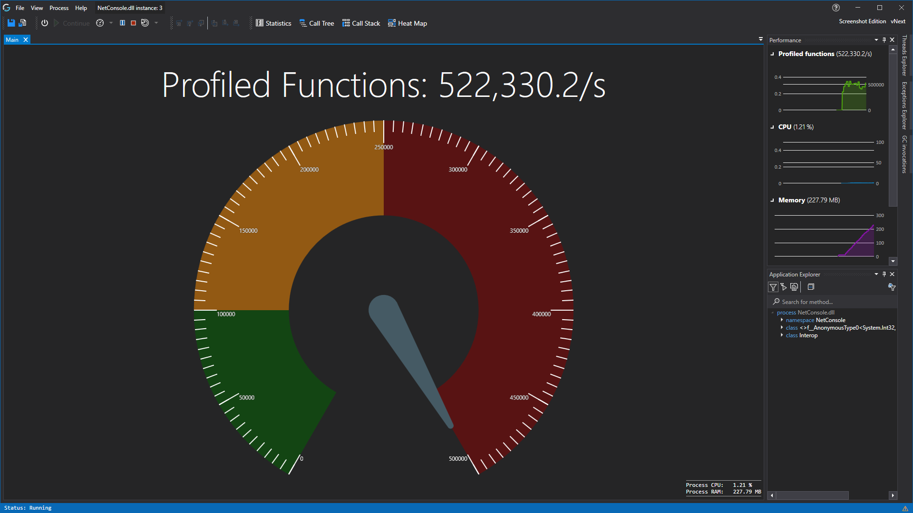

# Application Instance Window

This is the default window you see when you [start a new instance](../mainwindow/applicationInstance).
This just gives you a nice dashboard of your application, we might add more dashboard items in the future here.

From here you can access all the functionalities that CodeGlass has to offer. In the pages listed below you can find a more in depth explanation of all our features.

- [Main Tab](ApplicationInstanceDockWindow/MainWindow.md)
- [Call Tree Render Tab](ApplicationInstanceDockWindow/CallTreeRendering.md) 
- [Code Member Details Tab](ApplicationInstanceDockWindow/CodeMemberDetailsView.md) 
- [Performance Tool Pane](ApplicationInstanceDockWindow/PerformanceView.md)
- [Application Explorer Tool Pane](ApplicationInstanceDockWindow/ApplicationExplorer.md)
- [Thread Explorer Tool Pane](ApplicationInstanceDockWindow/ThreadExplorer.md) 
- [Exception Explorer Tool Pane](ApplicationInstanceDockWindow/ExceptionExplorer.md) 
- [Menu Bar](ApplicationInstanceDockWindow/MenuBar.md)
- [Toolbar](ApplicationInstanceDockWindow/Toolbar.md)

# F1 Info
If you came here by pressing F1 in the [CodeGlass Client](../features/CodeGlassClient.md) in one of the tabs, make sure that that tab has (keyboard) focus.
