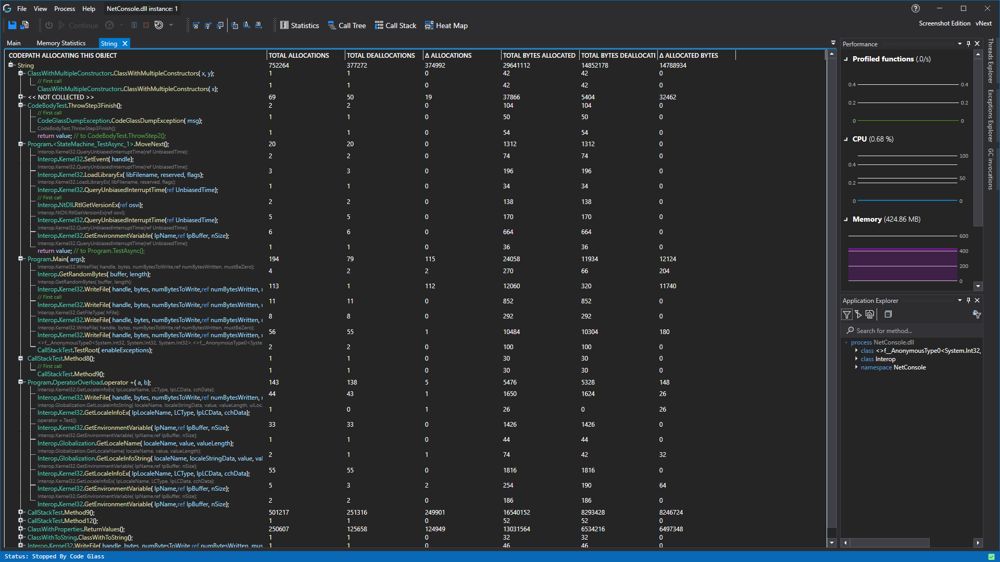

# Allocated by Code Path Memory Statistics View

This view shows all the function that have allocated this specific object. The nested functions shows between which function calls, in the body of the parent function, the object was allocated.



When you double click on one of the tree view items it will open the [code member details view](CodeMemberDetailsView).