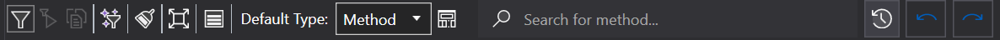

# Realtime Call Stack Rendering



See [Feature - Realtime call stack Rendering](../../features/RealtimeRendering.md#realtime-call-stack-rendering) for more information about the feature.

You can select to wich data object type you want to combines all calls in the [toolbar](#toolbar).

Hovering over an item will show you information about the Last and current threads using that function.

Hovering over a line will show you where it comes from and where it goes to. 

Right click on an item will open the [Context Menu](#item-context-menu).

Double clicking or with the conext menu of an item will open the [Object Detail View](ObjectDetailsView.md) of that item.



## Toolbar

With the toolbar you can do the following:

- Select what [filter](../../features/ProfilingDataFiltering.md) tyoe you want to use for filtering
    - Current Filters
    - Start Filters, see [Roadmap - Rendering Filter Types](../../Roadmap/RenderingFilterType.md)
    - No Filter, see [Roadmap - Rendering Filter Types](../../Roadmap/RenderingFilterType.md)
- [Filter](../../features/ProfilingDataFiltering.md) the current rendered items
- Clear the current render screen
- Reposition screen to default zoom and position 
- Selecting the object type new rendered items will be grouped by.
- Forcing all rendered items to be grouped by the selected object type.
- Open the [Settings window](#settings-window)



## Threads and Coloring



## Settings Window

Most of the settings are quite self explainitory.

You can choose to save these settings as your new default for new renders or only for this render.

# Application Breadcrumbs
- { All paths leading to } /  [Application Instance Window](../ApplicationInstanceDockWindow.md) / [View Menu](../ApplicationInstanceDockWindow/MenuBar.md#view-menu) / 

# See Also:
- [Realtime Call Tree Rendering](CallTreeRendering.md)
- [(Deprecated) Realtime Grouped Call Stack Rendering](GroupedCallStackRendering.md)
