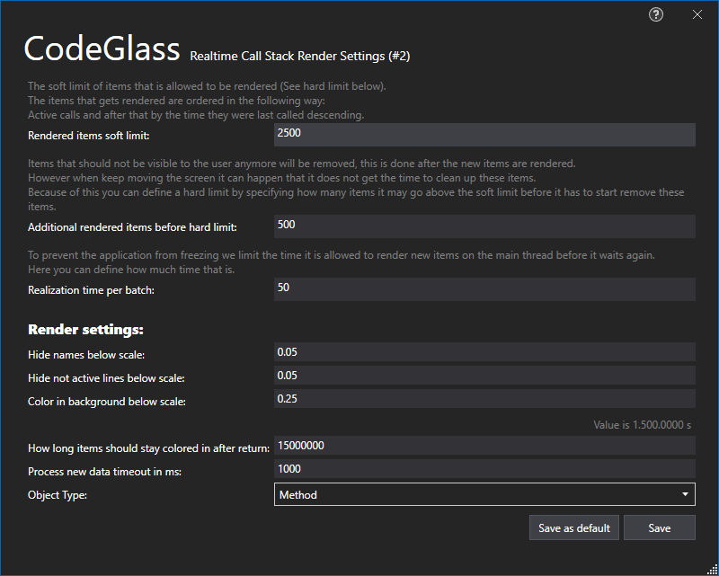

# Realtime Call Stack Rendering



## Toolbar

With the toolbar you can do the following:

- Select what [filter](../../features/ProfilingDataFiltering.md) type you want to use for filtering
    - Current Filters
    - Start Filters, see [Roadmap - Rendering Filter Types](../../Roadmap/ImprovedRenderingFilterType)
    - No Filter, see [Roadmap - Rendering Filter Types](../../Roadmap/ImprovedRenderingFilterType)
- [Filter](../../features/ProfilingDataFiltering.md) the current rendered items
- Clear the current render screen
- Reposition screen to default zoom and position 
- Opens the [interactions explorer](../../features/Interactions.md) pane.
- Selecting the object type new rendered items will be grouped by.
- Forcing all rendered items to be grouped by the selected object type.
- Search bar to search for methods by their name. Clicking on the search result will move the renderer to this method. By default you can only search for items within your rendering view.
- Toggling this button allows you to search for methods in history. This allows you to search for methods that are not in the rendering view right now.
- Step to Prev/Next Call, pressing these buttons will jump in the callstack to the searched method.
- Open the [settings window](#settings-window)

## Item Context Menu


## Threads and Coloring



## Settings Window

Most of the settings are quite self explanatory.

You can choose to save these settings as your new default for new renders or only for this render.

# Application Breadcrumbs
-  [Application Instance Window](../ApplicationInstanceDockWindow.md) / [View Menu](../ApplicationInstanceDockWindow/MenuBar.md#view-menu) / 

# See Also:
- [Realtime Call Tree Rendering](CallTreeRendering.md)
