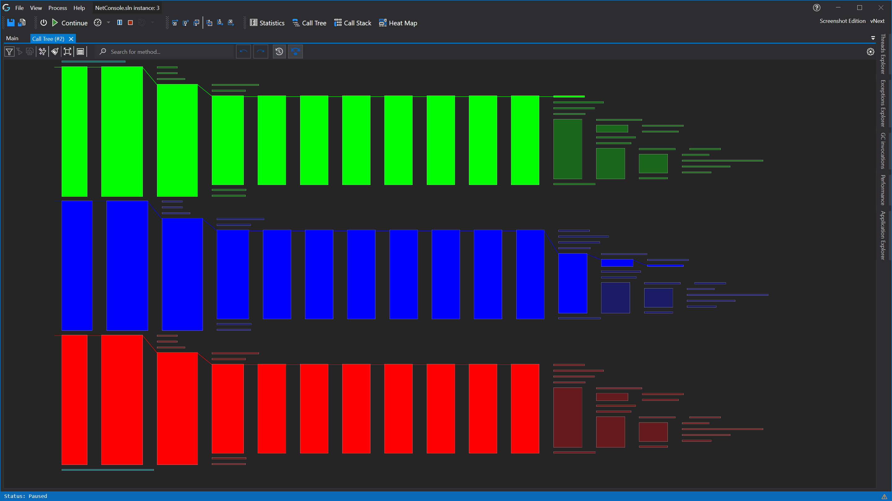

# Realtime Call Tree Rendering



See [Feature - Realtime call tree Rendering](docs/features/RealtimeRendering.md#realtime-call-tree-rendering) for more information about the feature.

Hovering over an item will show you information about the Last or current thread using that function.

Hovering over a line will show you where it comes from and where it goes to. 

Right click on an item will open the [Context Menu](#item-context-menu).

Double clicking or with the conext menu of an item will open the [Function Detail View](CodeMemberDetailsView.md) of that item.








## Threads and Coloring





# Application Breadcrumbs
- { All paths leading to } /  [Application Instance Window](../ApplicationInstanceDockWindow.md) / [View Menu](../ApplicationInstanceDockWindow/MenuBar.md#view-menu) / 

# See Also:
- [Realtime Call Stack Rendering](CallStackRendering.md)
- [Realtime Grouped Call Stack Rendering](GroupedCallStackRendering.md)
