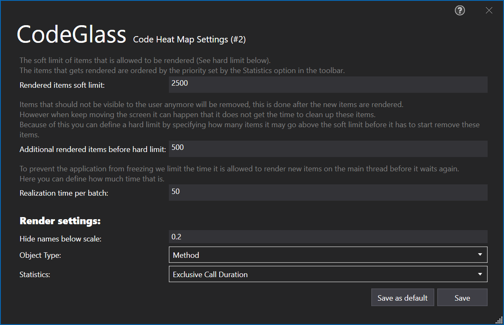

# Code Heat Map

See [Feature - Realtime Code Heat Map](../../features/RealtimeRendering.md#realtime-code-heatmap) for more information about this feature.

In the toolbar on top you can do multiple actions, in order they appear:
- Dropdown to select which object types you want to see.
- Dropdown to select which statistic you want to use
- Icon button to reorder the render to sort the items by the selected statistic.
- Icon button to open the [heat map visible items tool pane](#heat-map-visible-items-tool-pane) (Visible on the left of the screenshot).
- Icon button to reposition the screen to default zoom and position.
- Icon button to open the [heat map settings window](#heat-map-settings-window).

When you double click an item in the tree view it will open the [object details view](ObjectDetailsView.md) or [function details view](CodeMemberDetailsView.md) of the selected item.




## Heat Map Visible Items Tool Pane
You can open the tool pane by clicking on the button in the toolbar, this window shows all items that are currently visible to the user in order of selected statistic.
You can see an example of this pane in the screenshot above on the left side.

When you double click an item in the tree view it will open the [object details view](ObjectDetailsView.md) or [function details view](CodeMemberDetailsView.md) of the selected item.

## Heat Map Settings Window

Most of the settings are quite self explanatory.

You can choose to save these settings as your new default for heat map rendering or only for this heat map.

<!-- # Application Breadcrumbs
- [Application Instance Window](../ApplicationInstanceDockWindow.md) / [View Menu](../ApplicationInstanceDockWindow/MenuBar.md#view-menu) /  -->

# See Also
- [Application Instance Window](../ApplicationInstanceDockWindow.md)