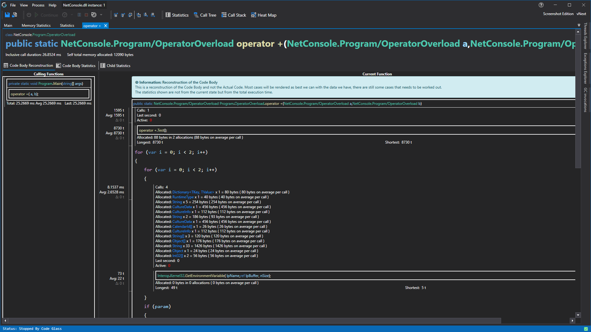
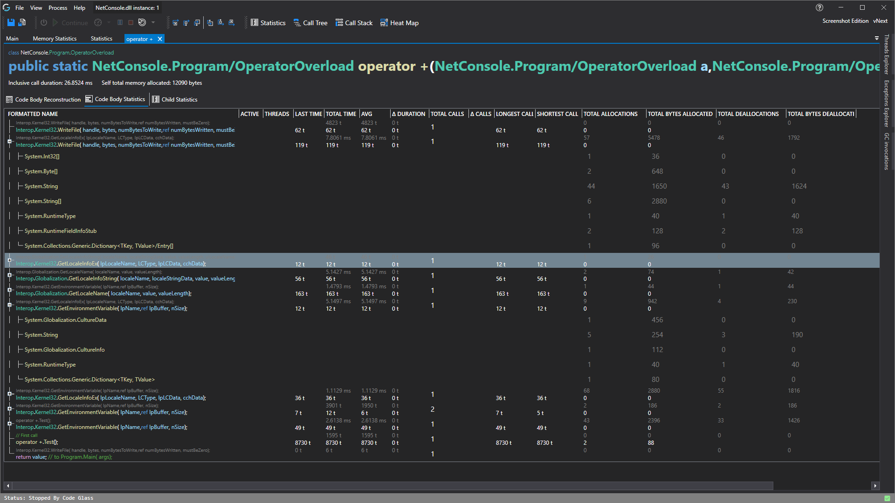
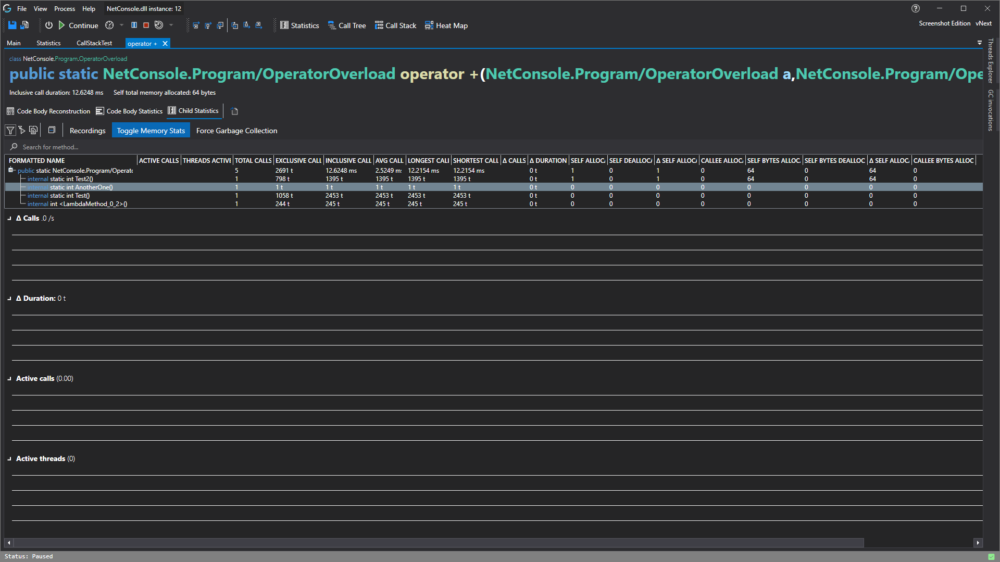

# Function Details View



This view has two inner views, [Code Body View](#code-body-view) and the [statistics view](#statistics-view).

See them for more information.

## Code Body View




From this view you can see on the left what functions call this function and how much time the function took for the caller.

On the Right you see the embodiement  of our [Code Body Reconstruction feature](../../features/CodeBodyReconstruction.md).  
This view shows you not only wich functions were called in real time by this function but so much more, inluding:
- Where in the code a function call was made. 
- What paths needs to be taken inside the function to reach a specific function call 
- How much time is spend in the body of the function between each function call. (This iliminates a huge part of the need to add stopwatches to your code)
- How many times a loop was executed
- How many times a path is taken
- Where a thread is in the function.
- Hot Paths
- Cold Paths
- Possibilities for optimizations, like loop unroling. 
- How your code really behaves against what you wrote.
- see [Code Body Reconstruction feature](../../features/CodeBodyReconstruction.md) for more.



Please keep in mind that this is an experimental feature available to anyone, for more information and help with any issues you might come across, check out [Code Body Reconstruction feature](../../features/CodeBodyReconstruction.md).

## Code Body Statistics View

This view gives you statistics on the code paths within the function, it shows you the same information what the [CodeBodyView](#code-body-view) shows but in a flat table that you can sort.



## Statistics View

This view looks and works allot like the [Statistics View](StatisticsWindow.md), the only exception is that it only shows the data  from this object instead of the whole profiled application instance by  namespace, classes, methods, etc.



# Application Breadcrumbs
- {All paths leading to} /  [Application Instance Window](../ApplicationInstanceDockWindow.md) / 
    - [View Menu](../ApplicationInstanceDockWindow/MenuBar.md#view-menu) / [Statistics View](StatisticsWindow.md) /
    - [View Menu](../ApplicationInstanceDockWindow/MenuBar.md#view-menu) / [Application Explorer](ApplicationExplorer.md) /
    - [View Menu](../ApplicationInstanceDockWindow/MenuBar.md#view-menu) / [Call Tree Rendering](CallTreeRendering.md) /
    - [View Menu](../ApplicationInstanceDockWindow/MenuBar.md#view-menu) / [Call Stack Rendering](CallStackRendering.md) /