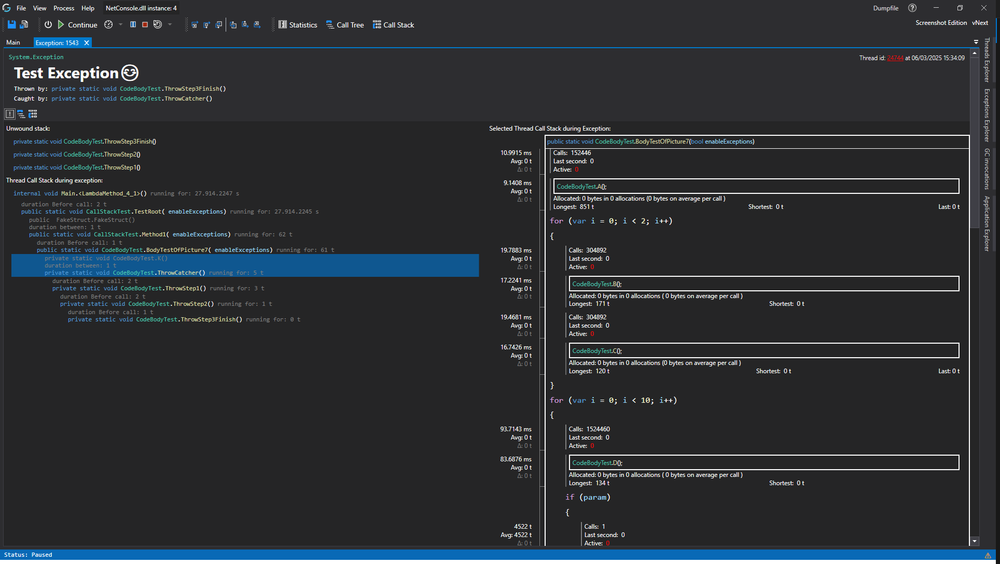

# Exception Details View

This view shows you data from the thrown exception, this includes:
- The Exception Type
- When the exception occurred.
- What function threw the exception.
- What function caught the exception.
- The call stack that got unwound when the exception happened.
- The [collected call stack](../../features/RealtimeDataCollection.md#callstack) of the remaining stack after it was caught .

This feature will be expanded upon with finer control and more information in the future. ([Roadmap](../../Roadmap/ImprovingExceptions.md))

# Application Breadcrumbs
- { All paths leading to } /  [Thread Explorer](ExceptionExplorer.md) / 