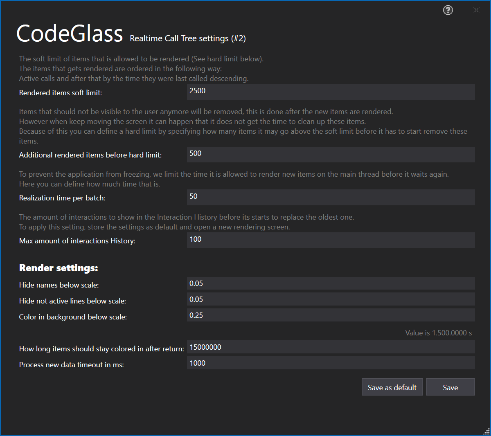
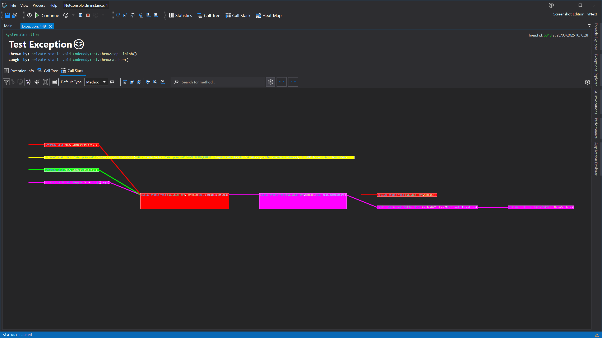

# Exception Details View

## Toolbar

- Opens the [info tab](#exception-info-view) 
- Opens the [call tree view](#exception-call-tree-view)
- Opens the [call stack view](#exception-call-stack-view)

### Exception Info View

This view shows you data from the thrown exception, this includes:
- The exception type
- When the exception occurred.
- What function threw the exception.
- Where in the function the exception was thrown.
- What function caught the exception.
- The call stack that got unwound when the exception happened.
- The [collected call stack](../../features/RealtimeDataCollection.md#callstack) of the remaining stack after it was caught.

This feature will be expanded upon with finer control and more information in the future. ([Roadmap](../../Roadmap/ImprovingExceptions.md))

### Exception Call Tree View



#### Call Tree Toolbar


#### Call Tree Settings Window

Most of the settings are quite self explanatory.

You can choose to save these settings as your new default for new renders or only for this render.

### Exception Call Stack View

#### Call Stack Toolbar


## Call Stack Settings Window

Most of the settings are quite self explanatory.

You can choose to save these settings as your new default for new renders or only for this render.

## Item Context Menu


## Threads and Coloring


<!-- # Application Breadcrumbs
- [Exception Explorer](ExceptionExplorer.md) /  -->