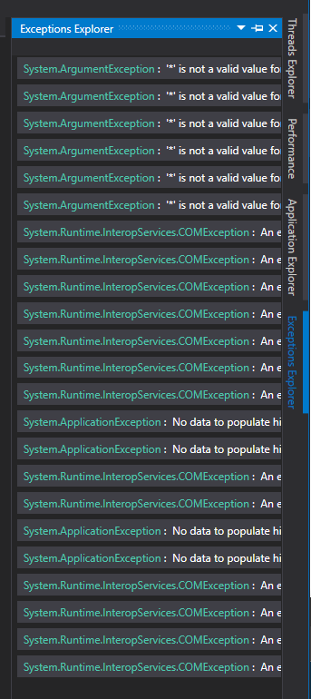

# Exception Explorer

The exception explorer shows the collected exceptions; the amount is limited by the maximum set in the [Appliations Profiler Settings](../ApplicationSettingsWindow/ProfilerSettings.md)

The list is ordered from oldest to newest.

When you double click an exception, it opens the [Exception details view](ExceptionDetailsView.md).

# Application Breadcrumbs
- { All paths leading to } /  [Application Instance Window](../ApplicationInstanceDockWindow.md) / [View Menu](../ApplicationInstanceDockWindow/MenuBar.md#view-menu) / 

# See Also:
- [Thread details window](ThreadDetailsView.md).