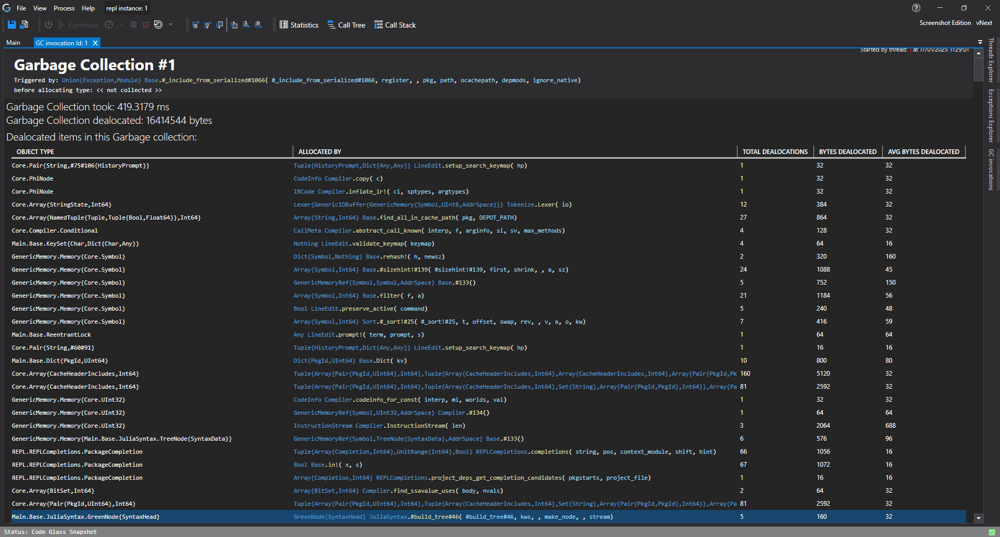

# GC Invocations Details View





This feature allows you to gain insights into what your application does during garbage collection. This can help you track down objects that do not get removed or find objects that get removed to fast.

## Garbage Collection Statistics
Besides seeing all the garbage collections that have happened, you can also view what happened during the garbage collection. The following pieces of information are available:
- The method that was being executed when the garbage collection was triggered.
- The type of the object that was being allocated when garbage collection was triggered.
- The amount of time the garbage collection took.
- The amount of bytes that were freed by the garbage collection.
- Every object that was deallocated, including the method that originally allocated that object.