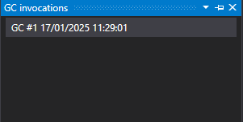

# Garbage Collection Invocations Explorer





The garbage collection invocations explorer shows all the collection garbage collection invocations. 

This list is ordered newest to oldest.

When you click on one of the items, it will open the [garbage collection invocations details view](GCInvocationsDetailsView.md).

# Application Breadcrumbs
- [Application Instance Window](../ApplicationInstanceDockWindow.md) / [View Menu](../ApplicationInstanceDockWindow/MenuBar.md#view-menu) / 

# See Also:
- [Garbage collection invocations details view](GCInvocationsDetailsView.md)