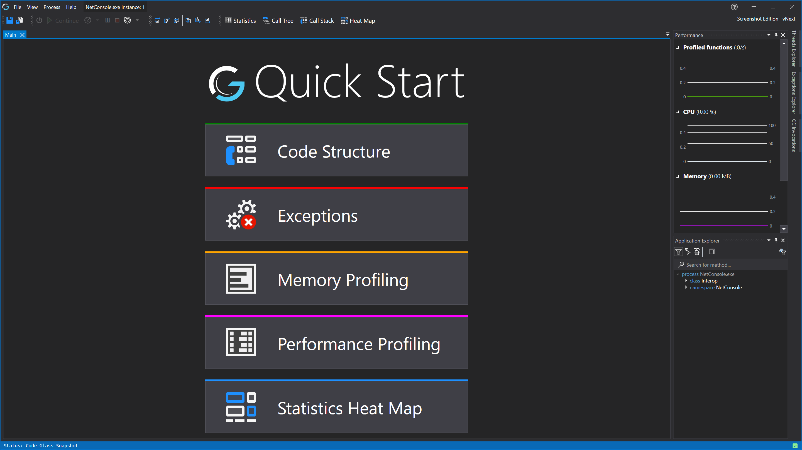

# Main Window

This is the default window you see when you [start a new instance](../mainwindow/applicationInstance).

This just gives you quick links to the main functionality of CodeGlass. We are planning to add more dashboard items in the future here, such as quick improvements and tutorials.
### Code Structure
This redirects to the [Call Stack rendering](CallStackRendering). You can use this to get insight in the structure of the profiled application.
### Exceptions
This opens and pins the [Exception Explorer](ExceptionExplorer). If it contains any items, the first of those exceptions will be opened to reveal the [Exceptions Details](ExceptionDetailsView).
### Memory Profiling
This opens the [Memory Statistics Window](MemoryStatisticsWindow), but only if memory statistics are enabled for this Application Instance.
### Performance Profiling
This opens the [Statistics Window](StatisticsWindow).
### Statistics Heat Map
This opens the [Heat Map Window](CodeHeatMap). This shows you visually where bottlenecks in the application may exist.

# See Also:
- [Application Instance View](../mainwindow/applicationInstance)