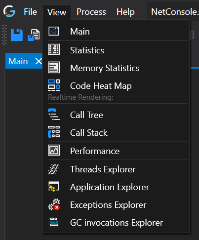
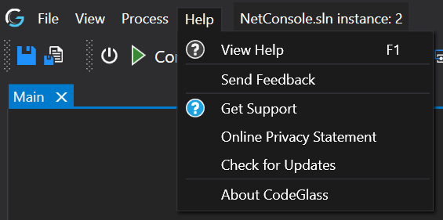

# Menu Bar

## File Menu

### New Instance
Clicking here will bring up the sub-menu to select what [filter](../../features/ProfilingDataFiltering.md) you want to use for the new instance.
Then clicking on "Start new instance" will start the new instance and open a new [Application Instance Window](../ApplicationInstanceDockWindow).

Double-clicking "New Instance" will directly start a new instance, and it will use the filters that are checked in the sub-menu. 
### Open Instance
Shows a sub-menu with the other profiled instances of this application; clicking on them will open another [Application instance Window](../ApplicationInstanceDockWindow.md) of that instance.
### Main Menu Window
Opens or brings the [Main menu window](../mainwindow.md) to the foreground
### Application Settings
Opens or brings the [Application Settings Window](../applicationsettingswindow.md) to the foreground
### Instance Settings 
Opens or brings the [Application Instance Settings Window](../ApplicationInstanceSettingsWindow.md) to the foreground
### User & Client Settings
Opens or brings the [Client & User Settings Window](../clientusersettingswindow.md) to the foreground
### Close
Closes this  [Application Instance Window](../ApplicationInstanceDockWindow.md).
### Exit
Shutsdown the [Code Glass Client](../../features/CodeGlassClient.md)


## View Menu

### Main
Opens the [Main](MainWindow.md) window in a new tab or brings the tab to the foreground   

### Console
See [Roadmap - Remote Console](../../Roadmap/RemoteConsole.md)

### Memory
See [Roadmap - MemoryProfiler](../../Roadmap/MemoryProfiler.md)

### Statistics
Opens the [Statistics](StatisticsWindow.md) window in a new tab or brings it to the foreground   

### Code Heat Map
This button opens a [Code Heat Map](CodeHeatMap.md) in a new tab.

### Realtime Call Tree Rendering
This button opens the [Realtime Call Tree Rendering](CallTreeRendering.md) in a new tab.

### Realtime Call Stack Rendering
This button opens the [Realtime Call Stack Rendering](CallStackRendering.md) in a new tab.

### Performance
Opens the [Performance](PerformanceView.md) view in a new tool window or brings it to the foreground   

### Thread Explorer
Opens the [Thread Explorer](ThreadExplorer.md) in a new tool window or brings it to the foreground   

### Application Explorer
Opens the [Application Explorer](ApplicationExplorer.md) in a new tool window or brings it to the foreground   

### Exceptions Explorer
Opens the [Exceptions Explorer](ExceptionExplorer.md) in a new tool window or brings it to the foreground.

## Process menu

### Start
[Starts](../../features/ApplicationInstanceExecutionControl.md#start) the application if it is not already.

### Continue
[Continues](../../features/ApplicationInstanceExecutionControl.md#pause--resume) the applicatio when it is paused

### Break
[Pauses](../../features/ApplicationInstanceExecutionControl.md#pause--resume) the applicatio when it is running or stops [stepping](../../features/ApplicationInstanceStepping.md).

### Stop
[Stops](../../features/ApplicationInstanceExecutionControl.md#pause--resume) the application if it is not stopped yet.

### Restart

Double-clicking Restart on the main menu will immediately start a new instance with the settings already selected below.



### Throttle

Double clicking [Throttle](../../features/ApplicationInstanceExecutionControl.md#throttle) on the main menu will enable or disable the throttling.



### Console

Create, attach a new console to the application, and close the old one if it had one.
- Show, shows the console if it had one.
- Hide, hide the console if it had one.
- Console Settings, Opens or brings the [console settings](../applicationsettingswindow/ProfilerSettings.md#console-settings) to the foreground

## Bring to Front
It brings the application to the front, if it is still running.

### Step Into 
[Steps Into](../../features/ApplicationInstanceStepping.md#step-into) (F11) the next function while the application is paused

### Step Back Into 
[Steps Back Into](../../features/ApplicationInstanceStepping.md#step-back-into) (Ctrl + F11) the previous function while the application is paused

### Step Over 
[Steps Over](../../features/ApplicationInstanceStepping.md#step-over) (F10) the next function while the application is paused

### Step Back Over 
[Steps Back Over](../../features/ApplicationInstanceStepping.md#step-back-over) (Ctrl + F10) the previous function while the application is paused

### Step Out 
[Steps Out](../../features/ApplicationInstanceStepping.md#step-out) (Shift + F11) the current function while the application is paused

### Step Back Out 
[Steps Back Out](../../features/ApplicationInstanceStepping.md#step-back-out) (Ctrl + Shift + F11) the current function back to before the current function was called while the application is paused

### Instance Settings
Opens or brings the [Application Instance Settings Window](../ApplicationInstanceSettingsWindow.md) to the foreground

## Help Menu

### View Help
Opens this website on the [Getting Help](../../Troubleshooting.md#getting-help) Page.

### Send Feedback
Opens this website on the [Sending Feedback](../../Troubleshooting.md#sending-feedback) Page.

### Get Support
Opens this website on the [Getting Support](../../Troubleshooting.md#getting-support) Page.

### Online Privacy Statement
Opens this website on the [Privacy Statement](../../Legal/Privacy.md) Page.

### Check for updates
Opens the [Releases page](https://github.com/CodeGlassDotIO/Docs/releases)

### About CodeGlass
Opens this website on the [About page](../../../pages/about.md)

# Application Breadcrumbs
- {All paths leading to} /  [Application Instance Window](../ApplicationInstanceDockWindow.md) / 
