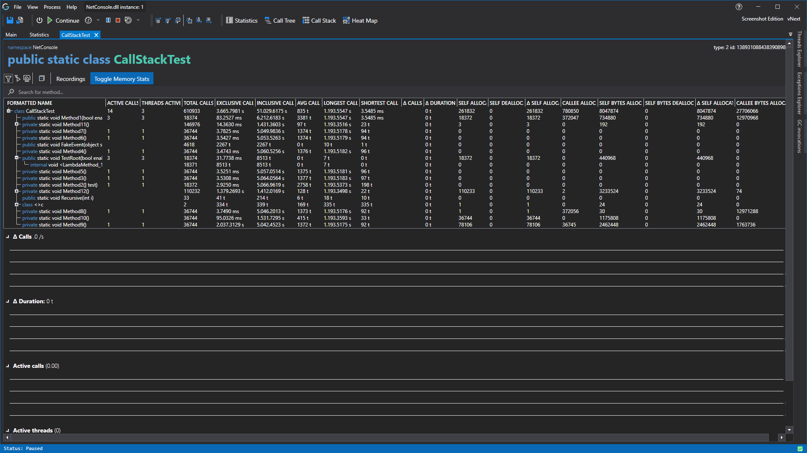

# Object Details View



This view looks and works allot like the [statistics view](StatisticsWindow.md), the only difference is that it only shows the data from this object instead of the whole profiled application instance by namespace, classes, methods, etc.



# Application Breadcrumbs
- [Application Instance Window](../ApplicationInstanceDockWindow.md) / 
    - [View Menu](../ApplicationInstanceDockWindow/MenuBar.md#view-menu) / [Statistics View](StatisticsWindow.md) /
    - [View Menu](../ApplicationInstanceDockWindow/MenuBar.md#view-menu) / [Application Explorer](ApplicationExplorer.md) /

# See Also:
- [Function Details View](CodeMemberDetailsView.md)
