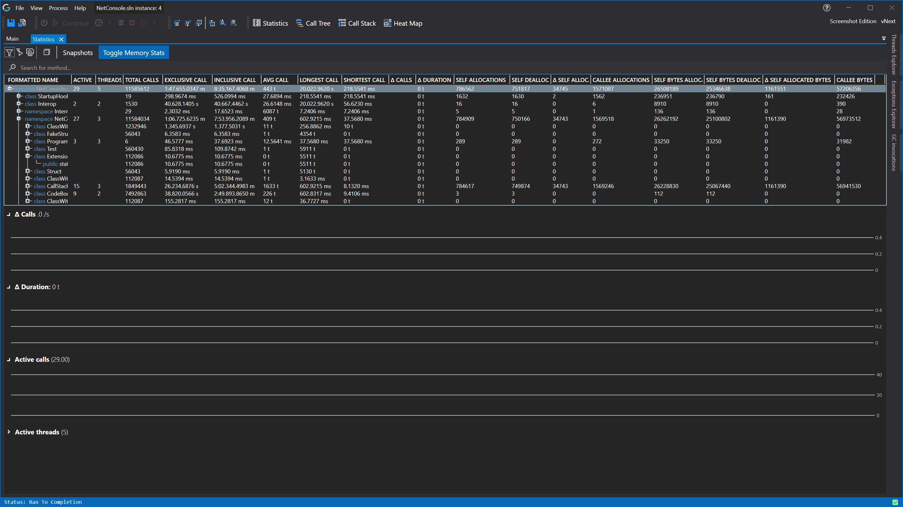

# Statistics View



## Memory Statistics
If you have an [experimental license](../../Editions/Experimental.md) and you have memory profiling enabled in the [application settings](../ApplicationSettingsWindow.md), this view will also give insight in the memory usage per namespace, class and method. 
In this view you can choose to toggle the visibility of the memory statistics by pressing the "Toggle Memory Stats" button.

# See Also:
- [Application Instance Window](../ApplicationInstanceDockWindow.md)
- [Object Details View](ObjectDetailsView.md)
- [Function Details View](CodeMemberDetailsView.md)
- [Feature - Time Messurement](../../features/TimeMessurement.md)
- [Feature - Profiling data filtering](../../features/ProfilingDataFiltering.md)
