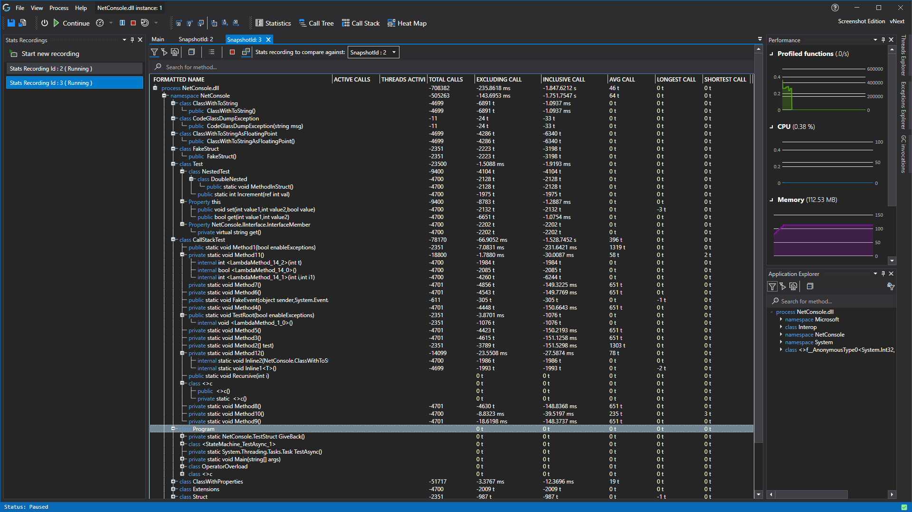
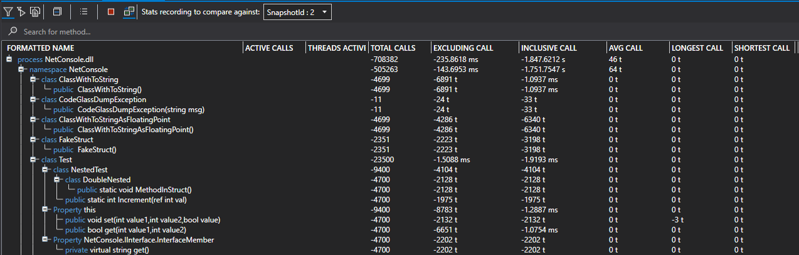

# Statistics Recordings View

This view shows the statistics of your recording of the profiled application.
The statistics are updated in real-time while the application and recording are running.

This view enables you to create and view snapshots of function statistics in different points in time. It's use is to show how functions behaved in between multiple recordings.
When you create a recording of your application, CodeGlass creates a copy of all information collected so you can compare different states of the application.

In the toolbar, you have multiple buttons. Each of them are described below.
- Show [current application instance filters](../../features/ProfilingDataFiltering#application-instance-filters).
- Show [application instance start filters](../../features/ProfilingDataFiltering#application-instance-start-filters).
- Apply no filters.
- Collapse all items in the tree view.
- Open the recording side bar that gives an overview of all you recordings.
- Stop recording. This stops the recording current snapshot.
- Enable comparing recordings. Enabling this allows you to select a snapshot to compare to. This causes the statistics table to show relative statistics. For example, lets say we are comparing snapshot 1 with snapshot 2. If snapshot 1 takes 50 ms to execute a function, and snapshot 2 takes 150 ms. The table would show -100 ms, as the current snapshot is 100ms faster.
- Stats recording to compare against. Here you can select the snapshot to compare to. This only affects the statistics table if "Enable comparing recordings" is enabled!

Below all these buttons, there is a search bar (Ctrl + F). Here you search for method using its name. When you select one of the suggestions, it will automatically expand the tree view until the searched method.

## Snapshots Statistics Difference
When comparing of recordings is enabled, you see the difference between the statistics of the current snapshot and the selected one.

## Available Data
The statistics table shows both namespaces/classes and methods. Because a namespace or class cannot have any direct calls to it, it shows the sum of all its children.

Currently we have the following data sets in order that they appear:
- Formatted Name, the name of the namespace, class or method.
- Active Calls, the amount of function being called in this item.
- Active Threads, the amount of active threads in this item.
- Total Calls, the total amount of calls made in this item.
- Exclusive Call, the total amount of [measured time](#time-measurement) spend in this item, excluding the duration of calls made in this item.
- Inclusive Call, the total amount of [measured time](#time-measurement) spend in this item, including the duration of calls made in this item.
- AVG, the average amount of [measured time](#time-measurement) spend in this item.
- Longest Call, the longest [measured time](#time-measurement) spend in this item.
- Shortest Call, the shortest [measured time](#time-measurement) spend int this item.



When you double click an item in the tree view it will open the [object details view](ObjectDetailsView) or [function details view](CodeMemberDetailsView) of the selected item.

## Time Measurement
To get more information on how we measure time, see [Feature - Time Measurement](../../features/TimeMessurement)

# See Also:
- [Application Instance Window](../ApplicationInstanceDockWindow.md)
- [Object Details View](ObjectDetailsView.md)
- [Function Details View](CodeMemberDetailsView.md)
- [Feature - Time Measurement](../../features/TimeMessurement.md)
- [Feature - Profiling data filtering](../../features/ProfilingDataFiltering.md)
