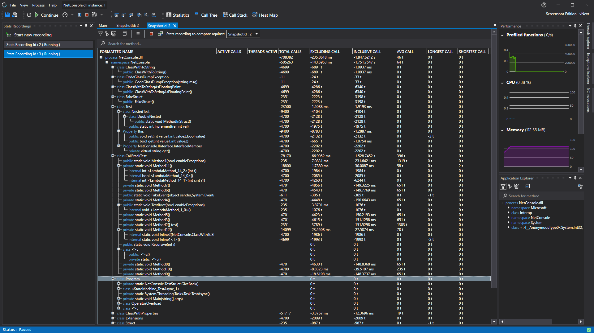
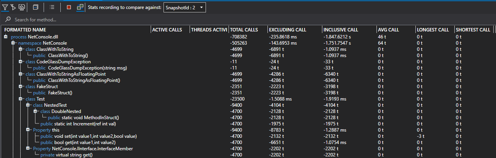

# Statistics Snapshots View

This view contains the general statistics of the profiled application.
The statistics are updated in real-time while the application is running.

This view enables you to make create and view snapshots of function statistics in different points in time. Its use is to show how functions behaved in between multiple snapshots.
In CodeGlass you can make statistic snapshots of a (running) application instance.
It creates a copy of all information CodeGlass collected so you can compare different states of the application.

In the toolbar, you have multiple buttons. Each of them are described below.
- Show [current application instance filters](../../features/ProfilingDataFiltering#application-instance-filters).
- Show [application instance start filters](../../features/ProfilingDataFiltering#application-instance-start-filters).
- Apply no filters.
- Collapse all items in the tree view.
- Open the [snapshot](../../views/applicationInstanceDockWindow/StatsSnapshotView) menu.
- Stop Snapshot. This stops the recording for the snapshot you are watching.
- Enable Div Snapshots. Enabling this allows you to select a snapshot to compare to. This causes the statistics table to show relative statistics. For example, lets say we are comparing snapshot 1 with snapshot 2. If snapshot 1 takes 50 ms to execute a function, and snapshot 2 takes 150 ms. The table would show -100 ms, as the current snapshot is 100ms faster.
- Stats snapshots div. Here you can select the snapshot to compare to. This only affects the statistics table if "Enable Div Snapshots" is enabled!

## Snapshots Statistics Difference
When Div Snapshots is enabled, you see the difference between the statistics of the current snapshot and the selected one.



# See Also:
- [Application Instance Window](../ApplicationInstanceDockWindow.md)
- [Object Details View](ObjectDetailsView.md)
- [Function Details View](CodeMemberDetailsView.md)
- [Feature - Time Measurement](../../features/TimeMessurement.md)
- [Feature - Profiling data filtering](../../features/ProfilingDataFiltering.md)
