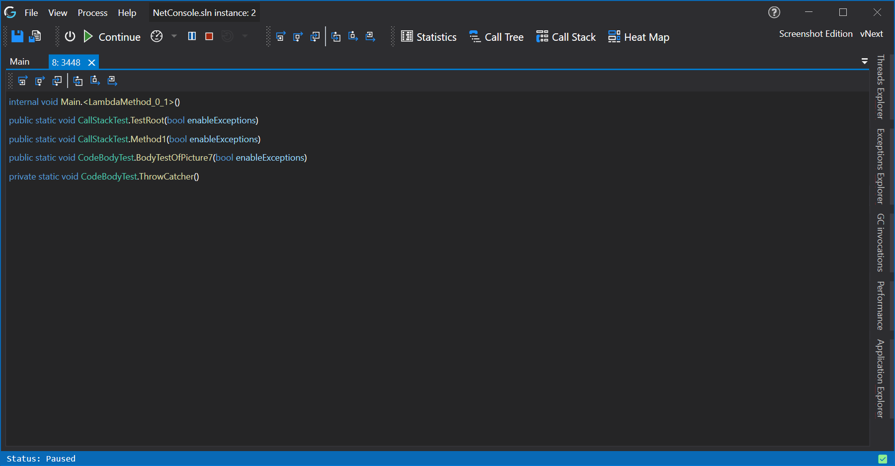

# Thread Details View

This view shows you the current call stack of the thread, it also reflect [call stack (thread) steps](../../features/ApplicationInstanceStepping.md) that you might have made, forwards but also backwards! 

But you can also step this thread specifically by the [thread stepping controls](#thread-stepping-controls) in the toolbar of this view.

## Thread Stepping Controls





### Known Issues
The thread stepping control hotkeys only work when there is focus on the thread details view, else it will use the regular stepping controls from the [toolbar](Toolbar#stepping.md) above it.

<!-- # Application Breadcrumbs
- [Thread Explorer](ThreadExplorer.md) /  -->