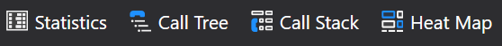

# Toolbar

## Snapshots

- Creates a snapshot of the current application, visible as a [snapshot instance](../mainwindow/applicationInstance.md) of this application.
- Creates a snapshot of the current application and stores it as a file so you can share it.  
    The file is saved in the folder you installed CodeGlass in on the connected [hub](../../features/CodeGlassHub.md).

For more information see [Feature - Profiling Snapshots](../../features/ProfilingSnapshots.md)

## Execution control

- [Soft off](../../features/ApplicationInstanceExecutionControl.md#soft-off), disables the collection of data but keeps the application running.
- [Continues](../../features/ApplicationInstanceExecutionControl.md#pause--resume) the applicatio when it is paused
- [Throttle](../../features/ApplicationInstanceExecutionControl.md#throttle) the application to a specific fps (Functions per second)
- [Pauses](../../features/ApplicationInstanceExecutionControl.md#pause--resume) the applicatio when it is running or stops [stepping](../../features/ApplicationInstanceStepping.md)
- [Stops](../../features/ApplicationInstanceExecutionControl.md#stop) the application if it is not stopped yet.
- [Restars](../../features/ApplicationInstanceExecutionControl.md#restart) the application

The Throttle button also has a dropdown with the following items:


The restart button also has a dropdown with the following items:


For more information see [Feature - Application Instance Execution Control](../../features/ApplicationInstanceExecutionControl.md)

## Stepping



## Realtime Rendering

- Opens the [Code Heat Map](CodeHeatMap.md) in a new tab.
- Opens the [Call Tree](CallTreeRendering.md) in a new tab.
- Opens the [Call Stack](CallStackRendering.md) in a new tab.
<!-- - Opens the [Grouped Call Stack Rendering](GroupedCallStackRendering.md) in a new tab. -->

For more information see [Feature - Realtime Rendering](../../features/RealtimeRendering.md)
# See Also:
- [Application Instance Window](../ApplicationInstanceDockWindow.md)
- [Feature - Application Instance Execution Control](../../features/ApplicationInstanceExecutionControl.md)

