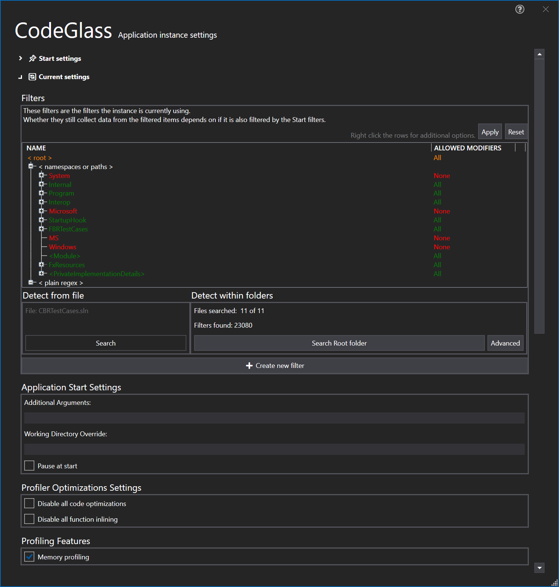

# Application Instance Settings Window

This view contains all the settings that apply to this application instance. It shows what the settins were when this instance was created, the current settings and then some some general information about the instance.

## Start settings
These application instance start settings are the the same as the [application settings](ApplicationSettingsWindow.md) and are explained in more detail there. The difference is that these cannot be edited, and apply only to this application isntance.
### Start Filters
In start filter section you can see the filters that were used at the start of the instance, for more information on this type of filter see [application instance start filters](../features/ProfilingDataFiltering.md#application-instance-start-filters)

To see how your filters are behaving it loads in data from previously run instances, if you do not want to first run your application you can choose to [decompile](#decompilation) the application.

## Current settings
These application instance settings are the the same as the [application settings](ApplicationSettingsWindow.md) and are explained in more detail there. The difference is that they apply only to this application instance.

### Filters
In the filters section you can manage the [application instance filters](../features/ProfilingDataFiltering.md#application-instance-filters) that are currently used for the application instance.



By pressing the "Apply" button you can set the current filters as the new [application filters](../features/ProfilingDataFiltering.md#application-filters) 
By pressing the "Reset" button you reset the filters back to the [application filters](../features/ProfilingDataFiltering.md#application-filters)

#### Create New Filters
By pressing the "Create new filter" button you open the add application filter window:

#### Decompilation



You can also here [decompile](#decompilation) to have more preview data on how your new filter would react.

## Information
In the information section, you can see some information about this instance. One of the more important pieces of information is the [tick duration](#tick-duration).

### Tick Duration
A tick is the most accurate time we can collect. The duration of a tick is difference per machine, however if you have Hyper-V enabled on your pc it will always be 10,000,0000 in a second (10.000 in a ms).
In this screen you see how many ticks there are in a second and what the interval is between a tick. 

To get more information on how we measure time, see [feature - time measurements](../features/TimeMessurement.md)