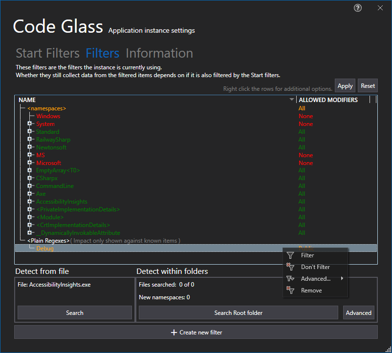
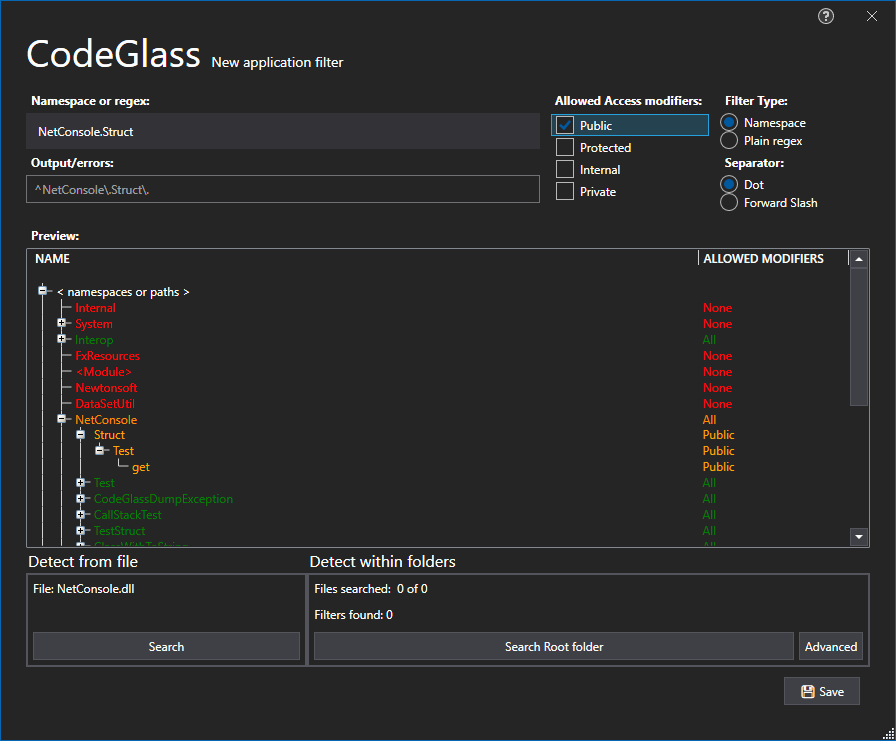

# Application Instance Filters Tab

In this tab you can manage the [Application Instance filters](../../features/ProfilingDataFiltering.md#application-instance-filters) that are currently used for the application instance.



To see how your filtes are behaving it loads in data from previous ran instances, with this you can now very easily adjust the items you want to filter or not.  
You can also change \<namespaces\> to not allow anything and only allow the one you are interested in (Whitelisting esc.)
If you do not want to first run your application you can choose to [decompile](#decompilation) the application.

## Apply to application filters
By Pressing this button you can set the current filters as the new [Application filters](../../features/ProfilingDataFiltering.md#application-filters)

## Reset to application filters
By Pressing this button you reset the filters back to the [Application filters](../../features/ProfilingDataFiltering.md#application-filters)

## Create new filter
By Pressing this button you open the Add Application Filter Window:


You can also here [Decompile](#decompilation) to have more previeuw data on how your new filter would react.

## Decompilation


# Application Breadcrumbs: 
- [Splashscreen](../Splashscreen.md) / [Main Menu - Applications](../mainwindow/application.md) / [Main Menu - Instances](../mainwindow/applicationInstance.md) /  [Application Instance Window](../ApplicationInstanceDockWindow.md) / [File Menu](../ApplicationInstanceDockWindow/MenuBar.md#file-menu) / [Application Instance Settings Window](../ApplicationInstanceSettingsWindow.md) /

# See Also:
- [Application Instance Settings]("../ApplicationInstanceSettingsWindow.md")

- [Information Tab](Information.md)
- [Start Filters Tab](StartFilters.md)
- [Feature - Application Instance filters](../../features/ProfilingDataFiltering.md#application-instance-filters)

