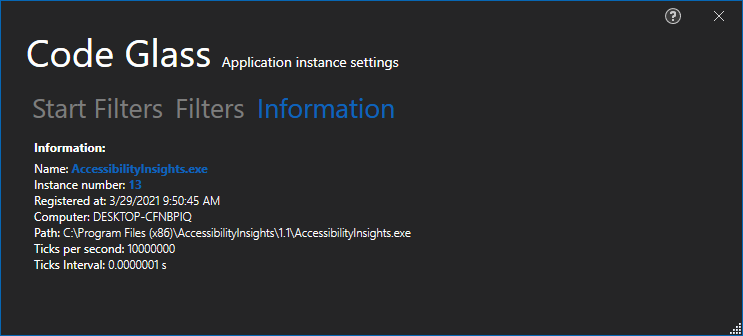

# Appliction Instance Information

In this tab you can see information about the instance, most notebly the [Tick duration](#tick-duration)

## Tick Duration
A Tick is the most accurate time we can collect, how long a tick is difference per machine, however if you have Hyper-V enabled on your pc it will always be 10,000,0000 in a second (10.000 in a ms).
In this screen you see how many ticks there are in a second and what the interval is between a tick. 

To get more information on how we messure time, see [Feature - Time Messurement](../../features/TimeMessurement.md)

# Application Breadcrumbs: 
- [Splashscreen](../Splashscreen.md) / [Main Menu - Applications](../mainwindow/application.md) / [Main Menu - Instances](../mainwindow/applicationInstance.md) /  [Application Instance Window](../ApplicationInstanceDockWindow.md) / [File Menu](../ApplicationInstanceDockWindow/MenuBar.md#file-menu) / [Application Instance Settings Window](../ApplicationInstanceSettingsWindow.md) /

# See Also:
- [Application Instance Settings Window](../ApplicationInstanceSettingsWindow.md)
- [Start Filters Tab](StartFilters.md)
- [Filters Tab](Filters.md)
- [Feature - Time Messurement](../../features/TimeMessurement.md)