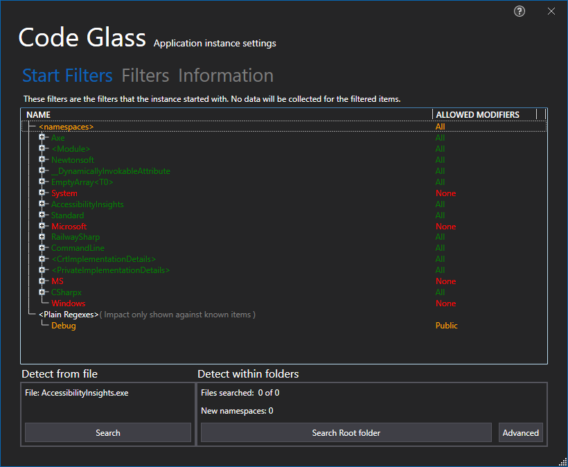

# Application Instance Start Filters

In this tab you can see the filters that were used at the start of the instance, for more information on this type of filter see [Feature - Application Instance Start Filters](../../features/ProfilingDataFiltering.md#application-instance-start-filters)

To see how your filtes are behaving it loads in data from previous ran instances, if you do not want to first run your application you can choose to [decompile](#decompilation) the application.

## Decompilation


# Application Breadcrumbs: 
- [Splashscreen](../Splashscreen.md) / [Main Menu - Applications](../mainwindow/application.md) / [Main Menu - Instances](../mainwindow/applicationInstance.md) /  [Application Instance Window](../ApplicationInstanceDockWindow.md) / [File Menu](../ApplicationInstanceDockWindow/MenuBar.md#file-menu) / [Application Instance Settings Window](../ApplicationInstanceSettingsWindow.md) /

# See Also:
- [Application Instance Settings](../ApplicationInstanceSettingsWindow.md)
- [Information Tab](Information.md)
- [Filters Tab](Filters.md)
- [Feature - Application Instance Start filters](../../features/ProfilingDataFiltering.md#application-instance-start-filters)