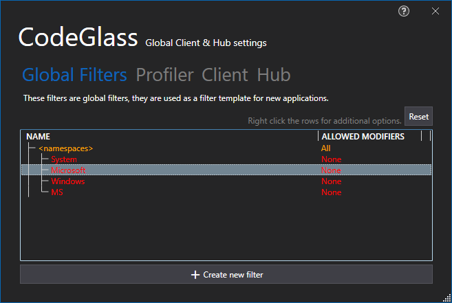

# Application Settings Window

This view stores all the settings that are directly bound to an application. This view contains all the settings as described on [here](clientusersettingswindow.md#profiler-settings).

# Application Breadcrumbs: 
- [Splashscreen](Splashscreen.md) / [Main Menu - Applications](mainwindow/application.md) / [Main Menu - Instances](mainwindow/applicationInstance.md) /
- [Splashscreen](Splashscreen.md) / [Main Menu - Applications](mainwindow/application.md) / [Main Menu - Instances](mainwindow/applicationInstance.md) /  [Application Instance Window](ApplicationInstanceDockWindow.md) / [File Menu](ApplicationInstanceDockWindow/MenuBar.md#file-menu) /

# See Also:
 - [Main Menu - Application instances](mainwindow/applicationInstance.md)
 - [Application Instance Window - File Menu](ApplicationInstanceDockWindow/MenuBar.md#file-menu)
