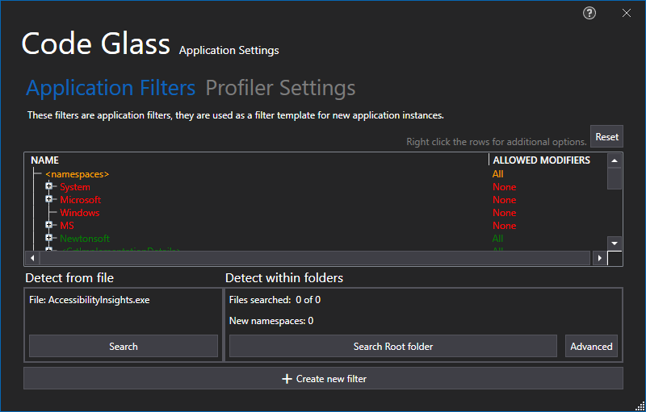

# Application Settings Window

This view has a couple of tabs, with [Application Filters](ApplicationSettingsWindow/ApplicationFilters.md) as opened tab when you open the window.

See each tab for more info:
## Tabs
 - [Application Filters Tab](ApplicationSettingsWindow/ApplicationFilters.md)
 - [Profiler settings Tab](ApplicationSettingsWindow/ProfilerSettings.md)

# Application Breadcrumbs: 
- [Splashscreen](Splashscreen.md) / [Main Menu - Applications](mainwindow/application.md) / [Main Menu - Instances](mainwindow/applicationInstance.md) /
- [Splashscreen](Splashscreen.md) / [Main Menu - Applications](mainwindow/application.md) / [Main Menu - Instances](mainwindow/applicationInstance.md) /  [Application Instance Window](ApplicationInstanceDockWindow.md) / [File Menu](ApplicationInstanceDockWindow/MenuBar.md#file-menu) /

# See Also:
 - [Main Menu - Application instances](mainwindow/applicationInstance.md)
 - [Application Instance Window - File Menu](ApplicationInstanceDockWindow/MenuBar.md#file-menu)
