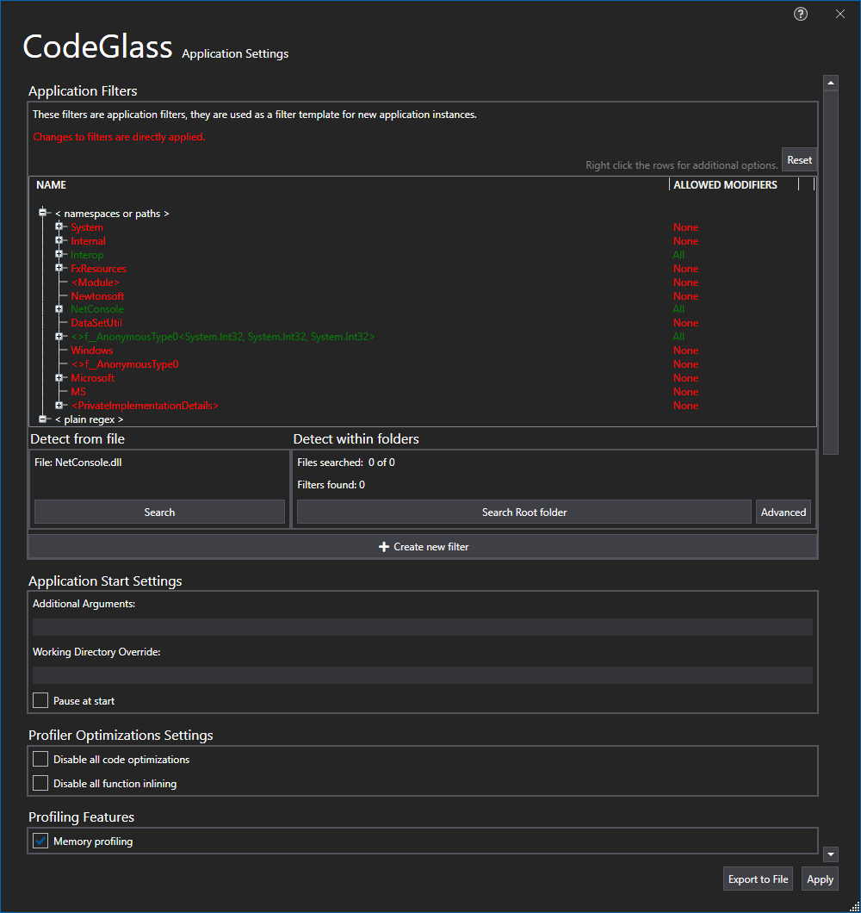

# Application Settings Window

This window shows all the settings of your application. When you start a new instance of this application, these settings will be used. When a new application is created, it uses the [global settings](clientusersettingswindow.md) as a template.

## Application Filters
At the top of the settings window you find the application [filter](../features/ProfilingDataFiltering.md) settings. By setting these filters you can tell CodeGlass which namespaces, classes or methods you do and do not want to profile.

By right clicking on any of these items you can select what to filter, and how to filter.

At the bottom, you also have two buttons that can detect all the namespaces, classes and methods of your application. It does this using [decompilation](#decompilation). This way you don't have to run your application first before being able to set your filters.

### Create New Filters

If you want to create more advanced filters that cannot be done by right clicking on an item, you can press the "Create new filter" button. This opens a new window that allows you to make more complex filters. Here you can supply a [namespace path](../features/ProfilingDataFiltering.md#namespace-path) or a Regex. Next to the input field you can also specify if the filter should apply to all access modifiers or only to a specific one.

At the bottom of the window you also have a little preview window that allows you to see your changes.

### Decompilation


## Application Start Settings
In the application start settings, you can give extra startup parameters that should be used to start your application. This is nice for when your application needs input arguments to work.

Here you can also tell CodeGlass to pause right away when starting an application. This can help you with solving issues that happen at startup.

## Profiler Optimizations Settings
In the profiler optimizations settings you can enable or disable compiler optimizations for your application. Disabling optimizations can make it easier to find your code back the way you have written it, and not what the compiler made from it.

## Profiling Features
In the profiling features settings you can enable or disable memory profiling. When you have memory profiling enabled you also get the option to include deallocations. When this option is enabled CodeGlass will also collect deallocations and start tracking garbage collections. This option is disabled by default as profiling deallocations might disable concurrent garbage collection in some languages and it can have a significant impact on performance.

## Exception Settings
In the exception settings you can set what CodeGlass should do when it profiles and exception. When an exception is profiled, CodeGlass stores this exception with some extra data like a (limited) copy of the callstack at that time. Here you can specify what and how much should be stored.

## Callstack Settings
In the callstack settings you can specify how many callstack items CodeGlass should store before overwriting older data. CodeGlass considers every call to a function and every return from a function as a separate callstack item. Increasing the amount of callstack items to store allows you to step further back in the history of your application, but it also makes CodeGlass heavier to run. If your application overwrites the callstack too fast, try applying more filters. This way CodeGlass has to store less callstack items.

# See Also:
 - [Main Menu - Application instances](mainwindow/applicationInstance.md)
 - [Application Instance Window - File Menu](ApplicationInstanceDockWindow/MenuBar.md#file-menu)
