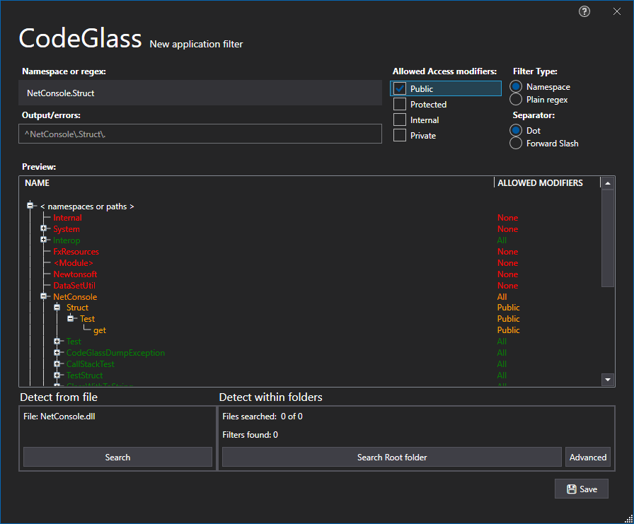

# Applciation Filters Tab

In this tab you can manage the [Application filters](../../features/ProfilingDataFiltering.md#application-filters) that will be set as default on any new application instance.



To see how your filtes are behaving it loads in data from previous ran instances, with this you can now very easily adjust the items you want to filter or not.  
You can also change \<namespaces\> to not allow anything and only allow the one you are interested in (Whitelisting esc.)
if you do not want to first run your application you can choose to [decompile](#decompilation) the application.

See [Application filters](../../features/ProfilingDataFiltering.md#application-filters) for more information on the filters.
## Reset to global filters
By Pressing this button you reset the filters back to your [Global filters](../../features/ProfilingDataFiltering.md#user-global-filters)

## Create new filter
By Pressing this button you open the Add Application Filter Window:


You can also here [Decompile](#decompilation) to have more previeuw data on how your new filter would react.

## Decompilation


# Application Breadcrumbs: 
- [Splashscreen](../Splashscreen.md) / [Main Menu - Applications](../mainwindow/application.md) / [Main Menu - Instances](../mainwindow/applicationInstance.md) / [Application Settings Window](../ApplicationSettingsWindow.md) /

# See Also:
 - [Application Settings Window](../applicationsettingswindow.md)
 - [Application Profiler Settings Tab](ProfilerSettings.md)
 - [Feature - Profiling data filtering](../../features/ProfilingDataFiltering.md)
 - [Feature - Decompilation For Filters](../../features/decompilation.md)

