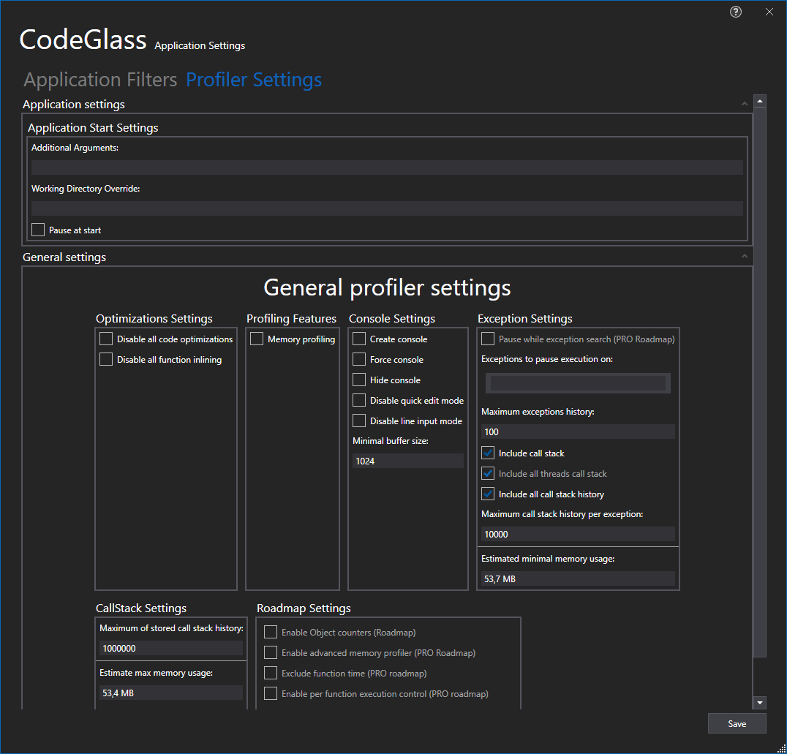

# Application Profiler Settings Tab



# Application Breadcrumbs: 
- [Splashscreen](../Splashscreen.md) / [Main Menu - Applications](../mainwindow/application.md) / [Main Menu - Instances](../mainwindow/applicationInstance.md) / [Application Settings Window](../ApplicationSettingsWindow.md) /

# See Also:
 - [Application Settings Window](../applicationsettingswindow.md)
 - [Application Filters Tab](ApplicationFilters.md)
