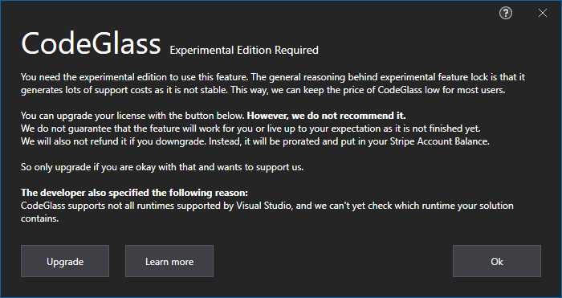
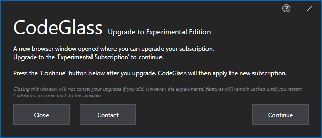
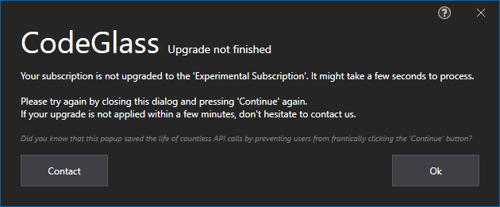
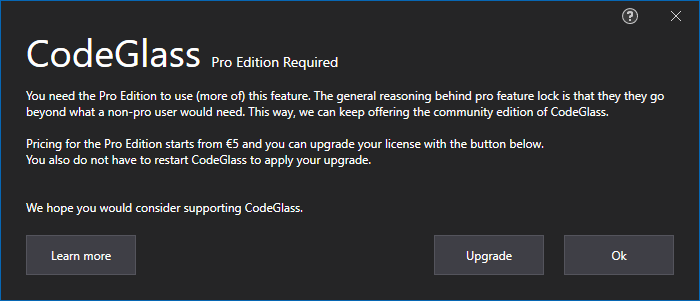
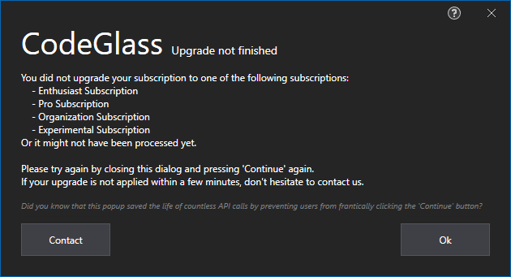
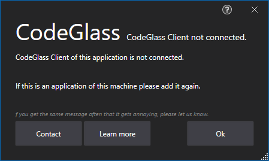
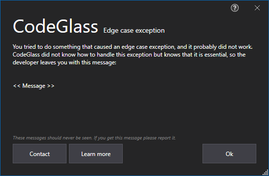
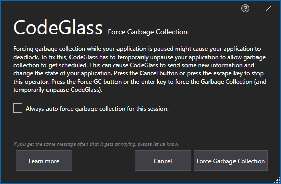

# Dialogs
These are dialogs not tied explicitly to a view and can happen on many locations. 

If you can't find the dialog you are searching for, go to the view that triggered it.

## Subscription Dialogs
#### Experimental Edition Required

If you encounter this screen, you try to access an experimental feature for which you need the [Experimental Edition](../Editions/Experimental.md).

You can upgrade your subscription to the [Experimental Subscription](../LicenseTypes/ExperimentalSubscription.md) with the "Upgrade" button. If you want to learn more about why the feature is experimental, click the "Learn More" button. 

Press "Ok" to continue using CodeGlass.

#### Upgrade to Experimental Edition

When clicking "Upgrade" on the [Experimental Edition Required Dialog](#experimental-edition-required), you encounter this screen.  
You can still decide not to upgrade by clicking "Close".

A browser window would have opened to the [change subscription page](../Others/ChangeSubscription.md).

The remaining part of the dialog is self-explanatory.

#### Upgrade to Experimental Edition Not Finished 

When clicking "Continue" on the [Experimental Edition Upgrade Dialog](#upgrade-to-experimental-edition), you encounter this screen when your upgrade is not finished yet. 

If you are sure that you upgraded correctly and it is not applied within a few minutes, don't hesitate to contact us!

The remaining part of the dialog is self-explanatory.

If you are annoyed by the popup, we are sorry, but please understand that we are billed by the number of API calls we make to our license provider. And even we in testing started to click that button frantically.

#### Pro Edition Required

If you encounter this screen, you try to access a pro feature for which you need the [Pro Edition](../Editions/Pro.md). 

You can upgrade your subscription to one of the following subscriptions with the "Upgrade" button:
- [Pro Subscription](../LicenseTypes/ProSubscription.md) 
- [Enterprise Subscription](../LicenseTypes/EnterpriseSubscription.md) 
- [Experimental Subscription](../LicenseTypes/ExperimentalSubscription.md), this also gives you access to the experimental edition; however, it is very pricy.

If you want to learn more about why the feature is pro edition only, click the "Learn More" button. 

Press "Ok" to continue using CodeGlass.

#### Upgrade to Pro Edition

When clicking "Upgrade" on the [Pro Edition Required Dialog](#pro-edition-required), you encounter this screen.  
You can still decide not to upgrade by clicking "Close".

A browser window would have opened to the [change subscription page](../Others/ChangeSubscription.md).

The remaining part of the dialog is self-explanatory.

#### Upgrade to Pro Edition Not Finished 

When clicking "Continue" on the [Pro Edition Upgrade Dialog](#upgrade-to-pro-edition), you encounter this screen when your upgrade is not finished yet. 

If you are sure that you upgraded correctly and it is not applied within a few minutes, don't hesitate to contact us!

The remaining part of the dialog is self-explanatory.

If you are annoyed by the popup, we are sorry, but please understand that we are billed by the number of API calls we make to our license provider. And even we in testing started to click that button frantically.

## Exception Dialogs

#### CodeGlass Client Not Online

You can get this screen when you are trying to start an application that was registered by another [client](../features/CodeGlassClient.md) that is currently not connected to the [hub](../features/CodeGlassHub.md) you are connected to.

*In the past, this also happened after a major Windows update that caused CodeGlass to identify existing clients as new clients and assign them a new Id.*
*Since CodeGlass 1.2 we haven't received any issue regarding this.*

#### Edge Case Exception

Every if should have an else, even if we think that the else might never occur; in those cases, we show this dialogue.

If you ever get this dialog, please report it with a screenshot and how you triggered it.

## Warning Dialogs

#### Force Garbage Collection Warning

You can get this dialog when you try to force the garbage collection to run while your application is in a paused state. Here you can choose to either cancel or force the garbage collection anyways. When you cancel nothing happens. When you force the garbage collection anyways CodeGlass first has to unpause your application to schedule the garbage collection. After that your application will be paused again.

If you check the checkbox and after that press the "Force Garbage Collection" button or press the "Enter" key, CodeGlass remembers this and not show this popup again and automatically force the garbage collection when you press the button again. This setting persist for the duration that the client is open. If you restart the CodeGlass client you will have to re-check this checkbox.

This unpausing is needed due to how garbage collection works. For garbage collection to work, the garbage collector needs to gain a "lock" on every executing thread. Because the application is paused, CodeGlass prevents some functions from continuing which prevents the garbage collector from gaining that lock. To bypass this problem CodeGlass needs to unpause your application and than schedule the garbage collector. This way it can get the locks on the executing threads. After the garbage collection has been scheduled CodeGlass re-pauses the application. This unpausing does have the downside that some new data will be send to CodeGlass during this unpaused moment. So keep in mind that your data might change when you force the garbage collection when in a paused state.