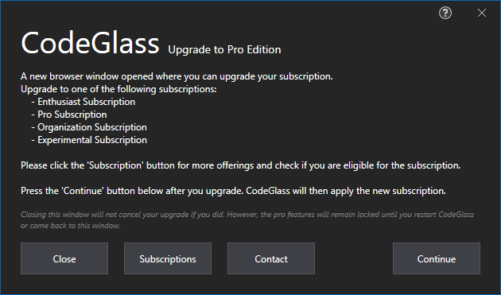

# Dialogs
These are dialogs not tied explicitly to a view and can happen on many locations. 

If you can't find the dialog you are searching for, go to the view that triggered it.

## Experimental Edition Required

If you encounter this screen, you try to access an experimental feature for which you need the [Experimental Edition](../Editions/Experimental.md).

You can upgrade your subscription to the [experimental subscription](../LicenseTypes/ExperimentalSubscription.md) with the "Upgrade" button. If you want to learn more about why the feature is experimental, click the "Learn More" button. 

Press "Ok" to continue using CodeGlass.

## Upgrade to Experimental Edition

When clicking "Upgrade" on the [Experimental Edition Required Dialog](#experimental-edition-required), you encounter this screen.  
You can still decide not to upgrade by clicking "Close".

A browser window would have opened to the [change subscription page](../Others/ChangeSubscription.md).

The remaining part of the dialog is self-explanatory.

## Upgrade to Experimental Edition not finished 

When clicking "Continue" on the [Experimental Edition Upgrade Dialog](#upgrade-to-experimental-edition), you encounter this screen when your upgrade is not finished yet. 

If you are sure that you upgraded correctly and it is not applied within a few minutes, don't hesitate to contact us!

The remaining part of the dialog is self-explanatory.

If you are annoyed by the popup, we are sorry, but please understand that we are billed by the number of API calls we make to our license provider. And even we in testing started to click that button frantically.

## Pro Edition Required

If you encounter this screen, you try to access a pro feature for which you need the [Pro Edition](../Editions/Pro.md). 

You can upgrade your subscription to one of the following subscriptions with the "Upgrade" button:
- [Enthusiast Subscription](../LicenseTypes/EnthousiastSubscription.md) 
- [Pro Subscription](../LicenseTypes/EnthousiastSubscription.md) 
- [Organization Subscription](../LicenseTypes/EnthousiastSubscription.md) 
- [Experimental Subscription](../LicenseTypes/EnthousiastSubscription.md), this also gives you access to the experimental edition; however, it is very pricy.

If you want to learn more about why the feature is pro edition only, click the "Learn More" button. 

Press "Ok" to continue using CodeGlass.

## Upgrade to Pro Edition

When clicking "Upgrade" on the [Pro Edition Required Dialog](#pro-edition-required), you encounter this screen.  
You can still decide not to upgrade by clicking "Close".

A browser window would have opened to the [change subscription page](../Others/ChangeSubscription.md).

The remaining part of the dialog is self-explanatory.

## Upgrade to Pro Edition not finished 

When clicking "Continue" on the [Pro Edition Upgrade Dialog](#upgrade-to-pro-edition), you encounter this screen when your upgrade is not finished yet. 

If you are sure that you upgraded correctly and it is not applied within a few minutes, don't hesitate to contact us!

The remaining part of the dialog is self-explanatory.

If you are annoyed by the popup, we are sorry, but please understand that we are billed by the number of API calls we make to our license provider. And even we in testing started to click that button frantically.

# See Also:

