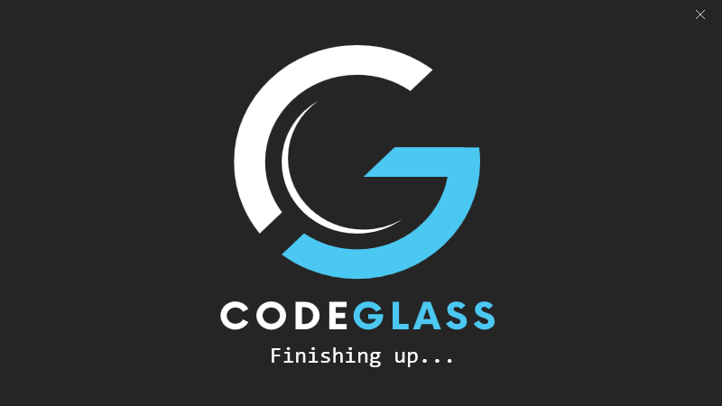

# Splashscreen

This is the load splash screen of Code Glass, it shows you the current loading status of the application and if something goes wrong a error code.  
After load it will go to the [login screen](#login) or [Main Menu](mainwindow.md) if you have logged in before. 

# Login

Here you can login into code glass with your licenced [CodeGlass account](../Others/Account.md#licensespring-codeglass-account) to get access to CodeGlass.

After a successful login you go to the [Main Menu](mainwindow.md).

It will remember your login next time you start so you will skip the login screen, to log out press [Logout](../views/mainwindow/application.md) on the main menu

# Information Screens
You might see a few information screens before or after login, they can be one of the following:

## Maximum Activations

You get this screen when you activated your subscription on to many devices, for a more detailed explaination to deactivate a device, click [here](../Others/CodeGlassLicensePortal.md#deactivate-devices)

## Hub version mismatch

You get this screen when your [client](../features/CodeGlassClient.md) is running a different version than the local [Hub](../features/CodeGlassHub.md) you are connecting to. 
It will also show which versions both are running.

## Remote Hub version mismatch

You get this screen when your [client](../features/CodeGlassClient.md) is running a different version than the [remote Hub](../features/CodeGlassHub.md#remote) you are connecting to. 
It will also show which versions both are running.

## Version end of life (EOL)

You get this screen when the version the hub is running is end-of-life (EOL); you should rarely or never see this screen.
We are not planning to make versions EOL. It is just a safety precaution for builds containing a major issue.
You might even see this more often on versions that are just released than versions that are years old.

We still have never made a version that is EOL.

## Failed To Validate Subscription

You get this screen when we cannot validate your license for any reason. You can continue using the application, but you are locked to [Community Edition](../Editions/Community.md) Features only.

## Subscription Expired

You get this screen when your subscription is expired. Click [here](../Others/ChangeSubscription.md) to change your subscription.

## Community Subscription

You get this screen when you have the [community subscription](../LicenseTypes/CommunityLicense.md).

## Enthusiast Subscription

You get this screen when you have the [community subscription](../LicenseTypes/CommunityLicense.md).

## Fallback license

You get this screen when you have the [fallback subscription](../LicenseTypes/CommunityLicense.md).

## Pro Edition Required

You get this screen when you need a [Pro Edition](../Editions/Pro.md) to connect to the current [hub](../features/CodeGlassHub.md). 

It will always show you a reason why it requires the pro edition.

## Upgrade To Pro Edition

You get this screen when clicking "Upgrade" on the [Pro Edition Required](#pro-edition-required) Info Screen.  
A browser will have opened on the [Change Subscription](../Others/ChangeSubscription.md) Page that will help you through upgrading your subscription.

When you click "Continue", it will check if your subscription has upgraded and continue if it has. If the upgrade was not sufficient, it will show the [Pro Upgrade not finished](../views/Dialogs.md#upgrade-to-pro-edition-not-finished) dialog.

## Experimental Required

You should never see this screen when starting the [client](../features/CodeGlassClient.md).  
Only on infrequent occasions get it when starting the [profiler](../features/CodeGlassProfilers.md), and the client did not catch earlier that you are trying to start a [runtime](../features/supportedruntimes.md) only available to the [experimental edition](../Editions/Experimental.md).

It will also always display a reason for showing this screen.

## Upgrade To Experimental Edition

You get this screen when clicking "Upgrade" on the [Experimental Edition Required](#experimental-edition-required) Info Screen.  
A browser will have opened on the [Change Subscription](../Others/ChangeSubscription.md) Page that will help you through upgrading your subscription.

When you click "Continue", it will check if your subscription has upgraded and continue if it has. If the upgrade were insufficient, it would show the [Experimental Upgrade not finished](../views/Dialogs.md#upgrade-to-experimental-edition-not-finished) dialog.

## Inception

You will get this screen when you try to profile CodeGlass with CodeGlass.

# Application Breadcrumb:
This is the root of the application, the first view you see when you start the [Code Glass Client](../features/CodeGlassClient.md)

# See Also:
- [View - Main Menu](mainwindow.md)

