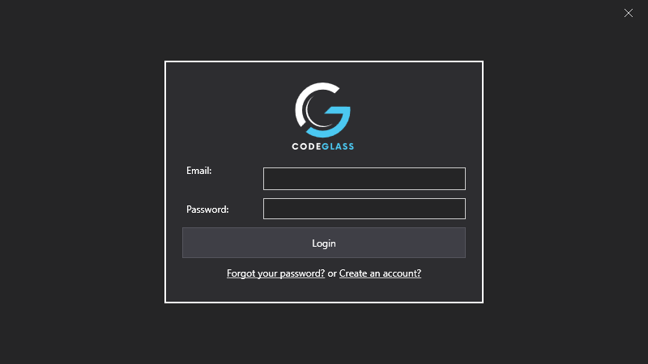

# Splashscreen

This is the load splash screen of Code Glass, it shows you the current loading status of the application and if something goes wrong a error code.  
After load it will go to the [login screen](#login) or [Main Menu](mainwindow.md) if you have logged in before. 

# Login

Here you can login into code glass with your licenced CodeGlass account to get access to CodeGlass.

After a successful login you go to the [Main Menu](mainwindow.md).

It will remember your login next time you start so you will skip the login screen, to log out press [Logout](../views/mainwindow/application.md) on the main menu

# Application Breadcrumb:
This is the root of the application, the first view you see when you start the [Code Glass Client](../features/CodeGlassClient.md)

# See Also:
- [View - Main Menu](mainwindow.md)

