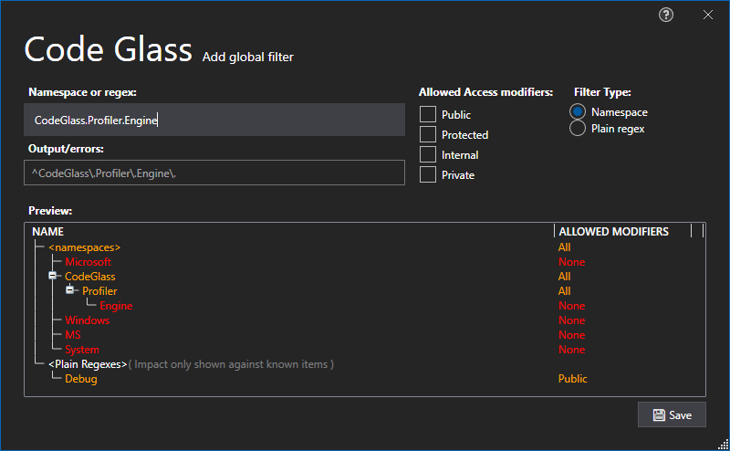
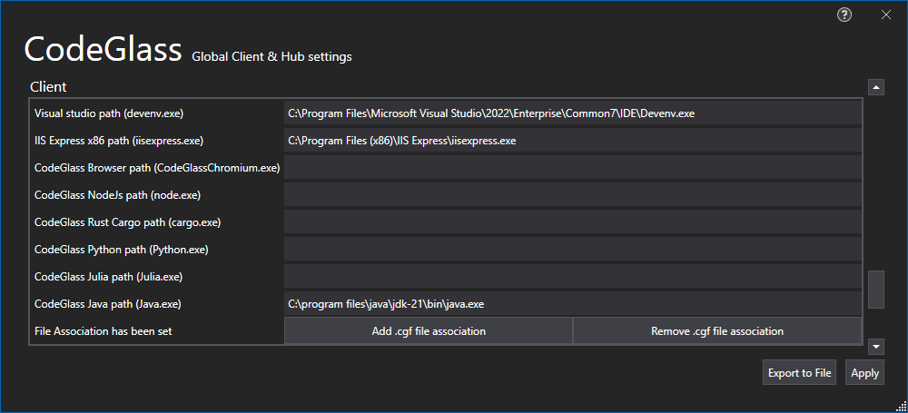

# Global Settings Window

This view contains all the global settings of CodeGlass. In this window you can set settings that apply as a template for all future applications you add, but it also contains some general settings.

## Global Filters
In the [global filters](../features/ProfilingDataFiltering.md#user-global-filters), you can set the filters that will be applied as the default filters to all new applications you add.



### Reset
By pressing the "Reset" button you reset the filters back to the [default filters](../features/ProfilingDataFiltering.md#default-filters)

### Create new filter
By pressing the "Create new filter" button you open the add global filter window:



## Profiler Settings

These profiler settings are the the same as the [application settings](ApplicationSettingsWindow.md) and are explained in more detail there.

## Client Settings
In the client settings you can set the path to different important locations, such as the path to custom CodeGlass runtimes.

For a list of possible locations where a program can be stored, look [here](clientusersettingswindow/CodeGlassPathSettings.md).

## Hub Settings
Right now there is only one hub specific setting. This is the option for if you want to shut the hub down if there are no [clients](../features/CodeGlassClient.md) or [profilers](../features/CodeGlassProfilers.md) connected to it anymore.

# See Also:
 - [Main Window](mainwindow.md)
 - [Application Instance Window - File Menu](ApplicationInstanceDockWindow/MenuBar.md#file-menu)
