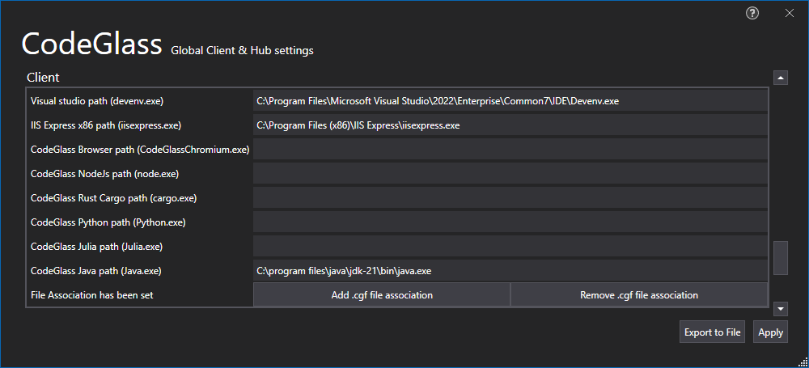

# Visual Studio Location
The path to Visual Studio (devenv.exe) is used for the [Visual studio project Runtime](../../features/supportedruntimes.md#visual-studio-solution) so that it can open the solution and start profiling the application when you start debugging.

Microsoft does not provide a way to detect a Visual Studio installation, because of this if it is not set we we check the following folders in order:

- "C:\Program Files\Microsoft Visual Studio\2022\Enterprise\Common7\IDE\Devenv.exe",
- "C:\Program Files\Microsoft Visual Studio\2022\Community\Common7\IDE\Devenv.exe",
- "C:\Program Files\Microsoft Visual Studio\2022\Professional\Common7\IDE\Devenv.exe",
- "C:\Program Files (x86)\Microsoft Visual Studio\2022\Enterprise\Common7\IDE\Devenv.exe",
- "C:\Program Files (x86)\Microsoft Visual Studio\2022\Community\Common7\IDE\Devenv.exe",
- "C:\Program Files (x86)\Microsoft Visual Studio\2022\Professional\Common7\IDE\Devenv.exe",
- "C:\Program Files (x86)\Microsoft Visual Studio\2019\Enterprise\Common7\IDE\Devenv.exe",
- "C:\Program Files (x86)\Microsoft Visual Studio\2019\Community\Common7\IDE\Devenv.exe",
- "C:\Program Files (x86)\Microsoft Visual Studio\2019\Professional\Common7\IDE\Devenv.exe",
- "C:\Program Files (x86)\Microsoft Visual Studio\2017\Enterprise\Common7\IDE\Devenv.exe",
- "C:\Program Files (x86)\Microsoft Visual Studio\2017\Community\Common7\IDE\Devenv.exe",
- "C:\Program Files (x86)\Microsoft Visual Studio\2017\Professional\Common7\IDE\Devenv.exe",
- "C:\Program Files (x86)\Microsoft Visual Studio 14.0\Common7\IDE\Devenv.exe"

Feel free to supply us with more folders.

# IIS Express x86 Location
The path to IIS Express x86 (iisexpress.exe) is used for the [Visual studio project Runtime](../../features/supportedruntimes.md#visual-studio-solution) so that when you want to profile an IIS Express x86 application it knows where IIS Express is located.

Microsoft does only provide a way to detect one IIS Express installation, so if you have both x64 and x86 installed it will will only detect the x64 installation.
Make sure that the value is pointing at the x86 installation and not the x64 installation.

If you have installed IIS Express in "Program Files" folder it will automatically check if you have IIS Express also installed in "Program Files (x86)".

# Application Breadcrumbs: 
- [Splashscreen](../Splashscreen.md) / [Main Menu](../mainwindow.md) / [Client and user settings Window](../clientusersettingswindow.md)

# See Also:
 - [Visual studio project Runtime](../../features/supportedruntimes.md#visual-studio-solution)
 - [Client and user settings Window](../clientusersettingswindow.md)
 - [Global Filters Tab](globalfilters.md)
 - [Profiler setting Tas](profilingsettings.md)
 - [Hub Settings Tab](HubSettings.md)
