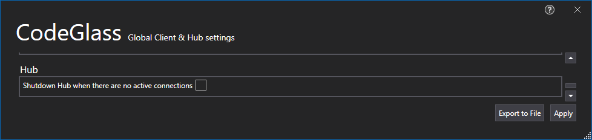

# Shutdown Hub when there are not active connections
Then there are no [clients](../../features/CodeGlassClient.md) and [profilers](../../features/CodeGlassProfilers.md) connected to the [hub](../../features/CodeGlassHub.md) the hub will shutdown. 

# Application Breadcrumbs: 
- [Splashscreen](../Splashscreen.md) / [Main Menu](../mainwindow.md) / [Client and user settings Window](../clientusersettingswindow.md)

# See Also:
 - [Visual studio project Runtime](../../features/supportedruntimes.md#visual-studio-solution)
 - [Client and user settings Window](../clientusersettingswindow.md)
 - [Global Filters Tab](globalfilters.md)
 - [Profiler setting Tas](profilingsettings.md)
 - [Client settings Tab](ClientSettings.md)
